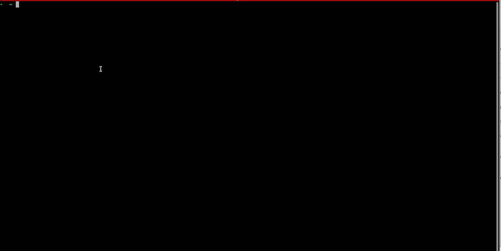

# 1 - Host ou imagem docker com vulnerabilidades conhecidas
---

[Artigo Principal](../index.html/#1---host-ou-imagem-docker-com-vulnerabilidades-conhecidas)

Um dos perigos mais frequentes de docker e uso de suas imagens são as CVE (Common Vulnerabilities and Exposures)


>"Identificar, defini e catalogar vulnerabilidades de segurança cibernética divulgadas publicamente" - missão CVE.org

Com base nesta base de dados da CVE, conseguimos identificar vulnerabilidades conhecidas, saber se ja foram mitigadas e como mitigar. 

Com o docker e suas imagens de containers temos ferramentas que identificam vulnerabilidades conhecidas em nossas imagens. 

Em nosso exemplo vamos utilizar o Trivy, porém listarei alguns exemplos que podemos usar também. 

- Trivy
- Horusec
- Snyk
- Docker Scout

## Exemplo de Scan usando o Trivy 

Ele funciona basicamente baixando bancos de dados que contem as CVEs ou problemas desejados e procura em sua imagem, código ou repo 

[Instalação do Trivy](https://trivy.dev/v0.18.3/installation/)


### Scan de imagens 

```
trivy image <nome-imagem> 

trivy image nginx:1.1.1

```


O trivy suporta diversos parametros, com o comando `trivy help` conseguimos vê-los. 

Outro interessando é a forma de output dele. 

### Scan de repositórios

O trivy também varre repos de código, trazendo vulnerabilidades e tornando a ferramenta mais versátil. 

O comando é parecido, porém com a difereça do input, sendo agora `repo` ao invés de image

```
trivy repo <link repo>
trivy repo https://github.com/knqyf263/trivy-ci-test #repo de testes do trivy 
```

### Scan de file system 

Assim como as demais, apenas alterar o parametro para `fs` irá procurar problemas no file system, que pode ser um path de seu computador

```
trivy fs <path>
trivy fs ./ #scan da pasta local
```

### Flags de Scanners

Outra funcionalidade bacana é o paramétro `--scanners` que suporta uma serie de valores que definem o que se deseja procurar

```
trivy image --scanners vuln,secret,misconfig,license <nome-image>
```

Por padrão ele executa com todos possiveis

### Outputs 

Existe um plugin que faz o output para html de forma mais bonita chamado [scan2html](https://github.com/fatihtokus/scan2html)

Seu uso fica assim 

```
trivy scan2html image <nome-imagem> --scan2html-flags --output report.html
```

Para ter o output em json 

```
trivy image -f json -o results.json golang:1.12-alpine
```

[Docs](https://trivy.dev/v0.17.2/examples/report/)

### Plugins auxiliares

A comunidade cria diversos plugins para trivy e trabalha mais especificamente seus outputs de formas diferentes.

Facilitando o gerenciamento e visualização dos reports. 

Assim como tem o de html, existem outros, que podemos encontrar pesquisando. 

- [Lista de plugins](https://aquasecurity.github.io/trivy-plugin-index/)


### Imagens mais seguras 

Vemos que até imagens famosas, bem conceituadas e muito utilizadas tem vulnerabilidades conhecidas e não arrumadas.

Muito disso se da, pelo fato destas imagens utilizarem como base uma imagem que ja carrega estas vulnerabilidades, exemplos, nginx pode usar o ubuntu, o redis pode usar um alpine com vulnerabilidades. 

Podemos mitigar usando imagens [distroless](https://edu.chainguard.dev/chainguard/chainguard-images/about/getting-started-distroless/), conceito bem bacana sobre imagens simplistas e mais seguras.  

Existem imagens otimizadas para segurança, a empresa que lidera este conceito é a Chainguard, com suas imagens baseadas em [Wolfi](https://github.com/wolfi-dev).

Estas imagens tem a caracteristica de serem enxutas, ou seja de tamanho pequeno, com poucas layers e sem acesso root. 

Tendo o minimo do minimo necessário para executar softwares e aplicações. 

No site da [Chainguard](https://images.chainguard.dev/) podemos ver todas as opções que temos. 

Infelizmente para usar as versionadas temos de pagar, porém temos a latest para uso. 

Outra ferramenta que auxilia a criação de imagens base é o [Melange](https://edu.chainguard.dev/open-source/build-tools/melange/getting-started-with-melange/) que habilita construção de imagens minimas com `apko`. 

Mais exempos na sessão de otimização de imagens, [link aqui]()


