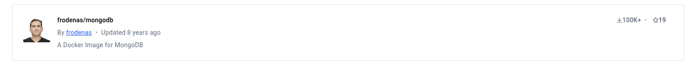
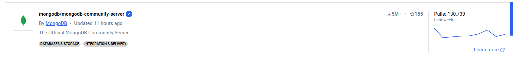
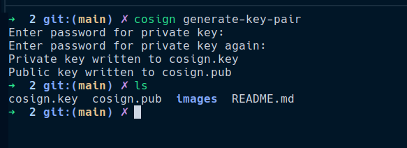
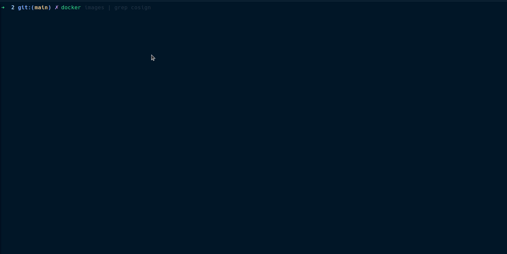
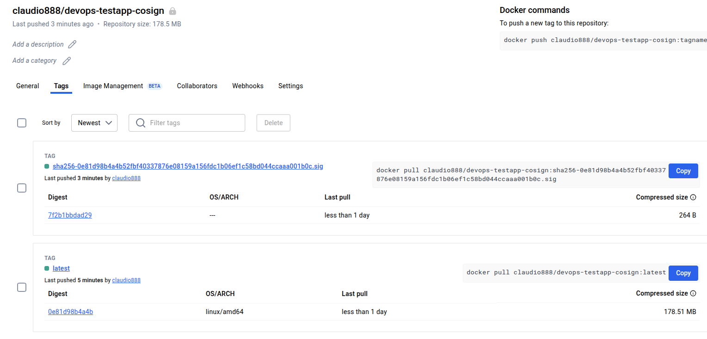
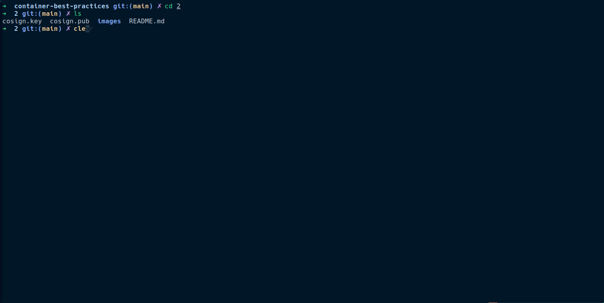

# 2. Imagens comprometidas
---

[Artigo Principal](../index.html/#2-imagens-comprometidas)

Muitas vezes caimos em armadilhas usando imagens docker de terceiros. 

É importante sempre procurar por imagens confiaveis do dockerhub, evitar imagens criadas por usuários especificos e sim utilizar a de organizações. 

Por exemplo, abaixo dois provedores de imagens do dockerhub. Qual parece mais confiavel? 





Vemos a diferença entre o numero de pulls, a frequencia de updates, e também a apresentação, o provedor verificado possuí um selo, e é melhor rankeado na pagina. 

Apesar de ser tentador utilizar imagens de terceiros em momentos especificos, por exemplo, preciso de uma imagem que tenha o `kubectl` e o `gcloud cli`, é recomendado que você crie a sua, e hospede em um lugar acessivel, do que utilize alguma imagem customizada por outros. 

### Remediações 

O conceito de assinaturas no docker, utilizando a ferrametna [cosign](https://github.com/sigstore/cosign) com base no sigstore, gerando mais confiabilidade em imagens, você pode verificar a autenticidade destas imagens verificando assinatura. 

Então podemos supor que você tem um registry na empresa, e só aceita imagens assinadas dele via pipeline, você pode a cada pull de nova imagem verificar a assinatura da imagem e garantir que isto veio do seu registry, e não de um outro local. 

Isto é feito passando a chave publica da assinatura e posteriormente será verificada com a chave privada. 

Vou criar um novo repo privado no docker hub e assinar uma imagem como exemplo. Vou considerar que ja tenho a ferramenta. 

Primeiro geramos a chave com o comando 

```
cosign generate-key-pair
```

Isto nos gera a chave private e .pub




Em seguida, posso pegar qualquer imagem que eu tiver e assinar a imagem, porém é importante que ela ja esteja no dockerhub. 

O comando é 

```
cosign sign -key cosign.key claudio888/devops-testapp-cosign:latest
```



Desta forma, o cosign assinou minha imagem com a chave gerada e enviou a mesma até o docker hub. 



o sha256 mostra que a imagem foi assinada. 

### Verificando imagem assinada

Quero agora verificar se minha imagem é realmente a que foi enviada por mim. 

Isto evita que você use imagens de outros registry, ou outras imagens que não sejam as suas. 

Rodamos então, chamando o cosign para verificar, e passamos a chave publica. Ou seja qualquer pessoa que possua a chave publica, pode verificar. 


```
cosign verify --key cosign.pub <imagem> 
```



Desta forma temos a certeza de que a imagem criada é a que enviamos, mitigando problemas de imagens infectadas com reverse shell, virus, backdoors, ransomware, etc. 

Isto adiciona uma complexidade a mais no gerenciamento de imagens, porém garante uma camada a mais e muito forte de segurança. 
