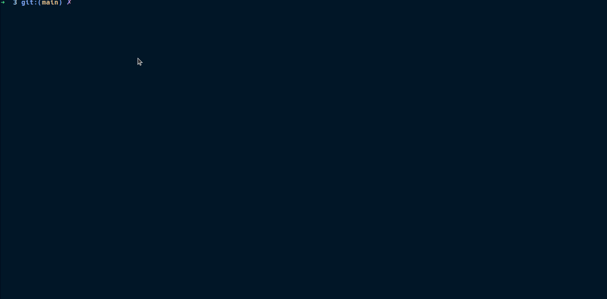
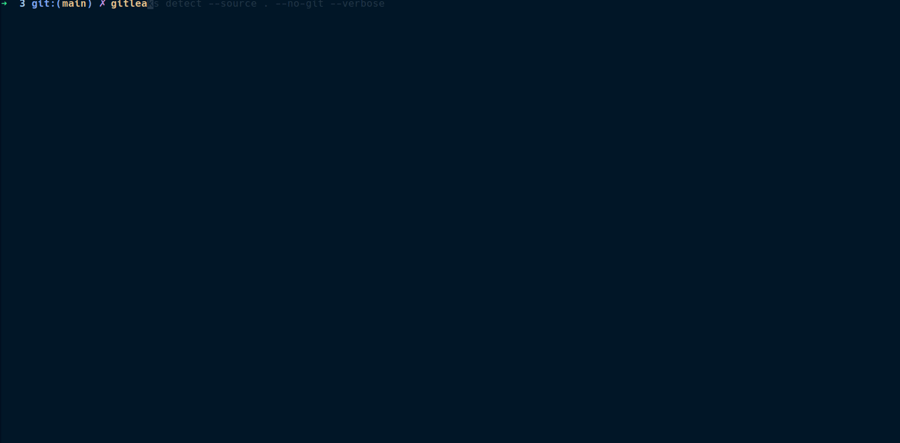

# Credenciais

[Artigo Principal](../index.html/#3-uso-de-credenciais-direto-na-imagem)

Não insira credenciais de forma hard coded no seu Dockerfile. 

Ou em qualquer outro arquivo que irá para o controle de versão (Git), mesmo que um arquivo .env local. 

Existem ferramentas que encriptam arquivos para mandar pro git, como gitcript. Porém prefira sempre definir variaveis de ambiente e secrets em tempo de execução, respeitando as recomendações do 12 factor app [sessão config](https://12factor.net/pt_br/config) armazene secrets e configurações no ambiente. 

Quando falamos de armazenar configuração e segredos no ambiente, podemos usar um docker secrets, um hashicorp vault, secrets do kubernetes, ou então dos provedores de nuvem, como google secrets ou aws secrets manager. 

### Encontrando secrets no código 

Podemos usar algumas ferramentas, quando bem configuradas podem pegar secrets. 

Como as abaixo 

- gitleaks
- trufflehog
- gitguardian
- SonarQube
- SecretScanner (varre imagens)

Entre outras. Cada uma tem sua caracteristica e geralmente são integradas com a pipeline. 

### Detect-secrets

### gitleaks

