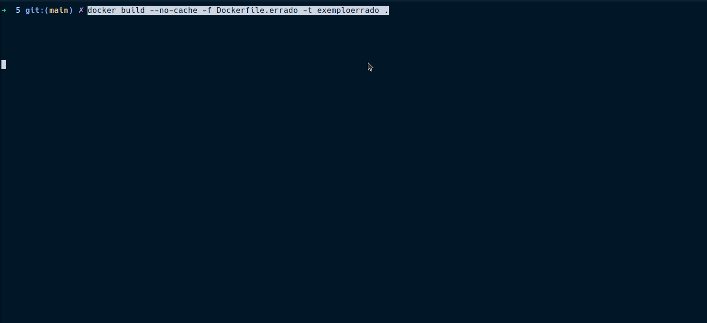
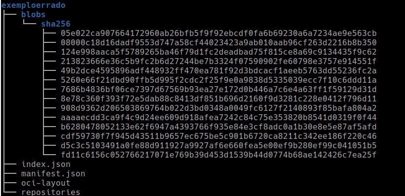
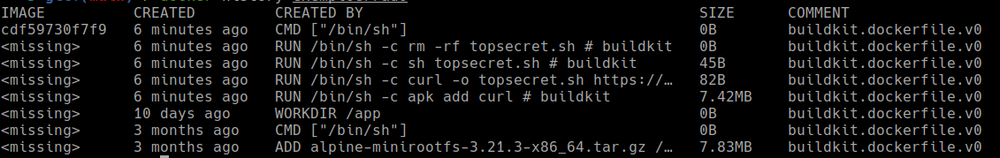
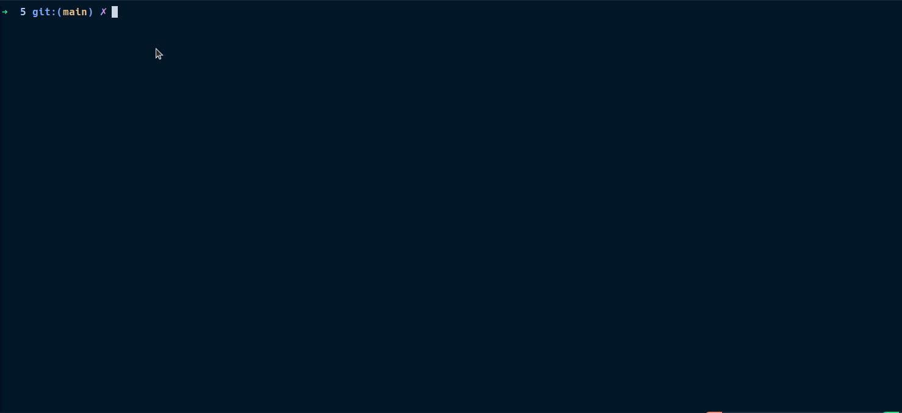
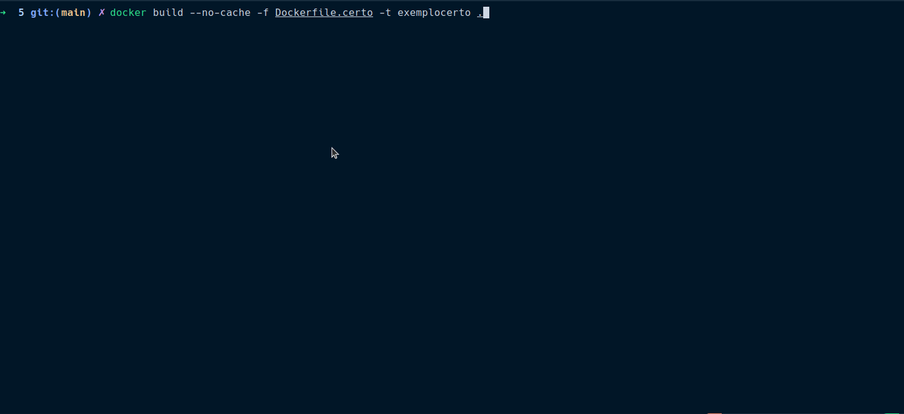
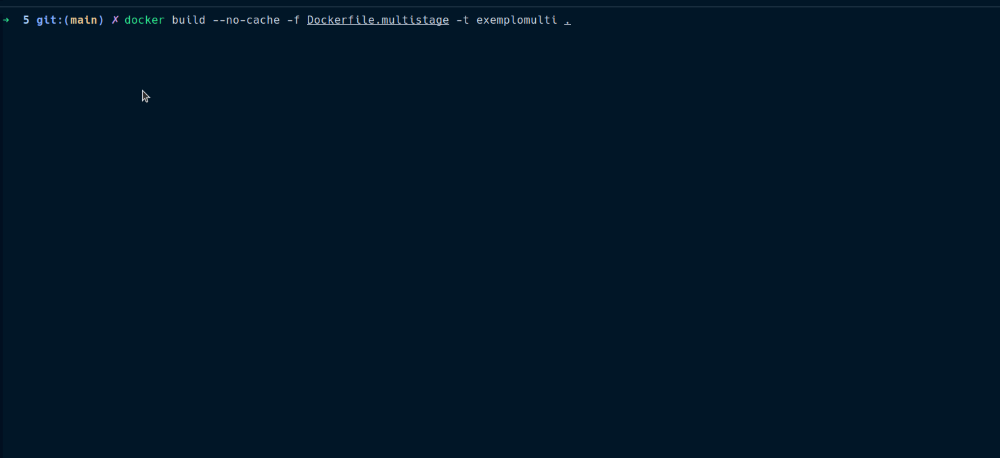

# Layers não otimizadas com arquivos sensíveis. 


[Artigo Principal](../index.html/#5-layers-não-otimizadas-com-arquivos-sensíveis)

O Docker tem uma arquitetura por camadas, que é um dos grandes diferenciais que permite reusabilidade e cache, trazendo beneficios para desempenho. 

Entender este conceito é importante , aqui um bom artigo sobre [Understanding docker layered architecture](https://freedium.cfd/https://medium.com/@kuldeepkumawat195/understanding-docker-layered-architecture-06695c80806f)

Exemplos que já falamos no documento principal deste conteudo, mostraremos em mais detalhes o problema.  

Demonstramos aqui, quando montamos um Dockerfile, a importancia de se atentar sobre camadas e entender em qual camada e qual a consequencia do comando em determinada camada. 

No exemplo abaixo, temos um arquivo `topsecret.sh`, vamos considerar que este arquivo contem informações sensíveis, e não pode ser exposto de forma alguma. 

Na ideia gera do Dockerfile, ele será baixado, irá gerar um outro aquivo, e posteriormente o `topsecret.sh` deve ser deletado. 

### Exemplo errado

Neste exemplo, vemos que usamos 4 comandos `RUN`, o que gera praticamente 4 camadas.
```
#Dockerfile.errado
FROM alpine:3.21.3
WORKDIR /app

RUN apk add curl 
RUN curl -o topsecret.sh https://gist.githubusercontent.com/Claudio888/a4a6222a72338d6566aed7cce4400102/raw/f777ca40c641f0ca2ffc41d11601324dc79b9853/gistfile1.txt && chmod +X topsecret.sh 

RUN sh topsecret.sh

RUN rm -rf topsecret.sh

CMD ["/bin/sh"]

```

Vamos analisar primeiramente em container runtime, ou seja, vamos rodar o comando e ver se o arquivo `topsecret.sh` continua presente no filesystem que acessamos. 



Observamos que como estamos na camada de RUNTIME, ou seja, a ultima camada criada no container, o comando de exclusão foi efetivo e pudemos ver apenas o arquivo gerado pelo script `topsecret.sh`. 

Agora vamos analisar as camadas desta imagem. 

Iniciamos gerando um `.tar` com a imagem gerada . 

```
docker save -o exemploerrado.tar exemploerrado:latest
```

Em seguida, vamos descompactar este `.tar` e observar o que temos nele. 

```
mkdir exemploerrado
tar -xf exemploerrado.tar -C exemploerrado 

```

Ao visualizarmos o diretório, temos dentro de `/blobs/sha256/` varios hashes, que aparentam ser nossas layers. 



Podemos ver as layers também usando o comando history do Docker. 

```
docker history exemploerrado:latest 
```



Outra forma de vermos as layers e explorar seus conteudos é com a ferramenta [dive](https://github.com/wagoodman/dive), que permite ótima exploração via terminal, para detecção de layers pesadas, ou até exploratórios. 

Seguindo nossos testes, queremos agora tentar acessar o conteudo destas layers.

Para isto, vamos contar com um simples script, que descompacta todas estas layers que encontramos no `.tar`. 

```
mkdir filesystem_errado

jq -r '.[].Layers[]' exemploerrado/manifest.json | while read layer; do
    tar -xf "exemploerrado/$layer" -C filesystem_errado
done
```

Com isto, teremos o filesystem das layers descompactado e montado em ordem correta dentro da pasta `filesystem_errado`. 

Ao acessar este diretório, vamos até a pasta `app` e vemos então que o arquivo `topsecret.sh` está disponivel para acesso, contando com seu conteudo original, que para nosso exemplo era secreto e não deveria estar disponivel a qualquer pessoa que tem acesso a imagem. 



Assim, conseguimos acesso a layers passadas, que nos proporcionam arquivos sensiveis. 

### Exemplo certo 
No exemplo `Dockerfile.certo` vemos que a sequencia toda de download, execução e exclusão, se apresentam num mesmo `RUN`, fazendo com que a modificação toda ocorra em apenas uma camada. 

```
#Dockerfile.certo
FROM alpine:3.21.3
WORKDIR /app

RUN apk add curl 
RUN curl -o topsecret.sh https://gist.githubusercontent.com/Claudio888/a4a6222a72338d6566aed7cce4400102/raw/f777ca40c641f0ca2ffc41d11601324dc79b9853/gistfile1.txt && \
    chmod +X topsecret.sh && \
    sh topsecret.sh && \
    rm -rf topsecret.sh

CMD ["/bin/sh"]

```
Fazendo os mesmos procedimentos listados no exploratório acima, temos um diretório assim 


Em seguida um exemplo do resultado das camadas, que vamos ver temos menos, e de como fica o filesystem após montagem feita via export de camadas




Esta solução da certo pois não armazenamos em nenhuma layer o arquivo `topsecret.sh`. 

### Multistage build


Outra solução plausivel para este problema é usar multi-stage build, onde você constrói o que é necessário em uma imagem, e copia apenas para outra

No exemplo abaixo, vou construir uma imagem, baixar o `topsecret.sh` e em seguida só vou copiar o resultado dele para minha build final, não tendo este arquivo nas minhas layers. 


```
FROM alpine:3.21.3 as buildstep 
WORKDIR /app

RUN apk add curl 
RUN curl -o topsecret.sh https://gist.githubusercontent.com/Claudio888/a4a6222a72338d6566aed7cce4400102/raw/f777ca40c641f0ca2ffc41d11601324dc79b9853/gistfile1.txt && \
    chmod +X topsecret.sh && \
    sh topsecret.sh && \
    rm -rf topsecret.sh

FROM alpine:3.21.3 

WORKDIR /app

COPY --from=buildstep /app/arquivosecret.txt .

CMD ["/bin/sh"]

```

Desta forma, o arquivo `topsecret.sh` fica apenas no builder e não está presente nas layers finais. 



### Conclusão
Portanto neste tópico vimos como é importante se atentar as layers, seja para segurança ou otimização. Existem cenários de cache de layers que também podem acarretar em problemas durante a construção de uma imagem, principalmente com muitos passos e mais complexa. 

A ordem que alteramos nosso dockerfile, faz com que layers sejam recriadas ou não, portanto se alteramos uma linha 4 de um dockerfile com 10 linhas,por exemplo, tudo o que esta abaixo será refeito. 

