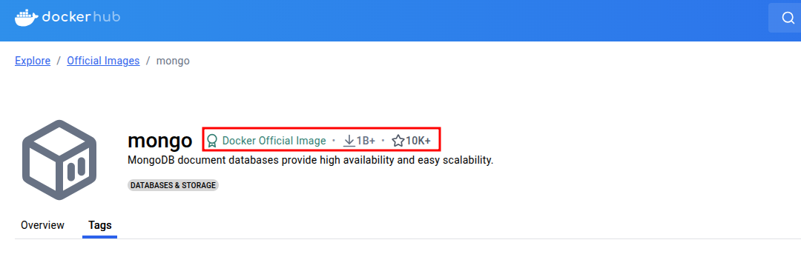
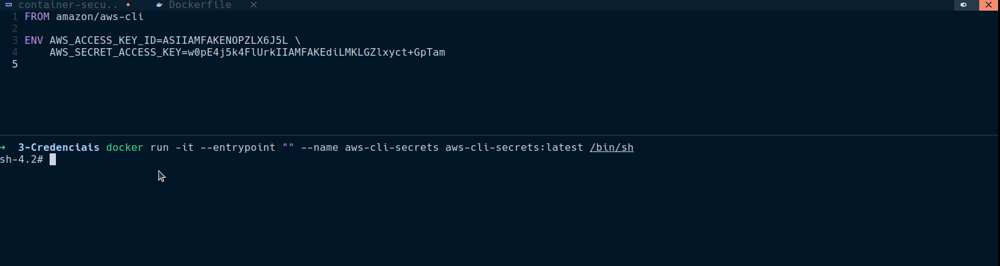
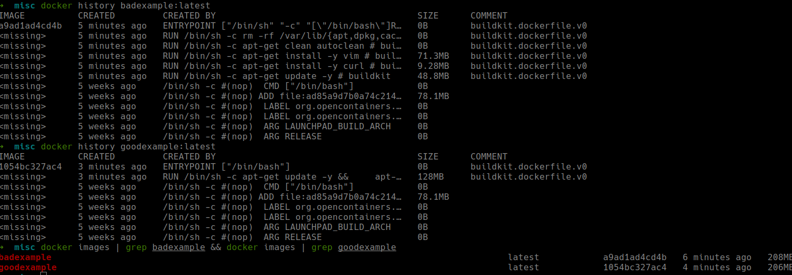
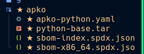
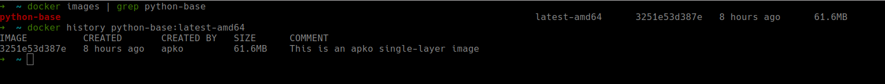
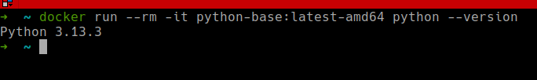

# Segurança em containers docker e otimização de imagens.

Neste artigo buscaremos passar por alguns dos muitos topicos relacionados a segurança e otmização de containers. 

Em especifico vamos utilizar e exemplificar usando o Docker, um dos mais conhecidos e usados. 

O objetivo é listar possíveis brechas de segurança e discutir como mitiga-las, através de pequenos exemplos e textos.


# Superficies de Ataques

Os containers modernos, revolucionaram a forma que desenvolvemos e entregamos software. Por serem leves e de muito mais facil distribuição, possuem esta vantagem em relação a VMs, carregam consigo todas bibliotecas e dependencias necessárias para execução de aplicações. 

Oferecem nativamente um bom modelo de segurança e isolamento, com a utilização dos namespaces do kernel, para executar processos em seu próprio quadrado, além de usarem cgroups para isolamento de uso de CPU e Memoria. 

Muitas vezes o cenário basico, e built in de segurança do Docker é o suficiente para iniciarmos seu aprendizado, testarmos alguma coisa especifica, trabalharmos offline e afins. 

Porém quando voltamos os olhos para produção, aplicações publicamente acessiveis, multiplos requests, interação entre containers, execução em orquestradores (Swarm, Kubernetes), nos deparamos com muitos pontos de segurança que valem a atenção e cuidados, para que não se torne um grande problema a execução de containers.

Vamos nos proximos tópicos trabalhar em cima destes possíveis cenários que envolvem executar containers em produção, pensando inicialmente em três superficies de ataque. As superficies estão descritas abaixo. 

Host - O local onde o docker e seus containers estão em execução, onde compartilham recurso, armazenam imagens locais, pode ser nossa maquina pessoal, um servidor na GCP, um cluster K8s na AWS ou afins. 

Client - O CLI, o docker instalado neste host, a forma que interagimos com os containers, com comandos e configurações a serem passadas ao Docker Daemon

Registry - Onde armazenamos nossas imagens(geralmente de forma remota), de onde o docker coleta imagens padrão e conhecidas, por exempo o registry DockerHub, o AWS ecr, ou o GCP Artifact Registry. 

Além destes tópicos também trataremos de otimização de imagens, e mostrando como a otimização colabora no quesito segurança.

# Top 10 

Neste tópico provavelmente não seguiremos todos os TOP 10 OWASP, porém muitos dos problemas aqui descritos também são tratados no artigo em questão.

Obtivemos de diversas fontes os tópicos que aqui vamos tratar, e que podemos encontrar muitas vezes descritos com outro nome, ou relacionados com outras questões. 

O objetivo é ser o mais sucinto e exemplar possível, descrevendo o problema, e sua mitigação de forma imediata. Trazendo um sentimento de cartilha a ser seguida, que fique facil de bater o olho, entender o problema e ver alternativas para mitiga-lo. 

Podemos também, destrinchar cada um dos tópicos com exemplos mais completos.

## 1 - Host ou imagem docker com vulnerabilidades conhecidas

**Descrição:** Imagem do host ou container docker com vulnerabilidades (CVEs) abertos e conhecidos

**Mitigação:**
- Atualize sempre o host, o serviço (K8s, DockerCLI) e a imagem do container
- Use imagens oficiais e atualizadas
- Faça scan de segurança com:
  - `trivy image <imagem>`
  - `docker scan <imagem>`
  - Ferramentas como Snyk ou Docker Scout

**Exemplo:**  
Executando ferramenta Trivy, para scan de imagem oficial do nginx. Mesmo com uma imagem oficial vemos a quantiade de CVEs. 


[Ver Mais](./1/index.html)

---

## 2. Imagens comprometidas

**Descrição:**  
Imagens de Host ou containers comprometido, contendo código maliciosos

**Mitigação:**
- Use imagens de fontes confiáveis
- Evite utilizar imagens de usuários em registry publicos 
- Verifique assinaturas com:
  - Docker Content Trust
  - cosign (do projeto sigstore)

**Exemplo:**  
No dockerhub ou em registry, procure sempre imagens oficiais, que contenham quantidade de downloads significativas e conhecidas.  



Podemos usar o [Docker Content Trust](https://docs.docker.com/engine/security/trust/#client-enforcement-with-docker-content-trust), ou verificar imagens com o cosign.

[Ver Mais](./2/index.html)

---

## 3. Uso de credenciais direto na imagem

**Descrição:**  
Senhas ou tokens salvos no Dockerfile ou na imagem final

**Mitigação:**
- Nunca salve segredos no `Dockerfile`
- Use `docker secrets`, `Vault`, ou `Kubernetes Secrets`, ou até variaveis de ambiente
- Escaneie com algum verificador estatico que procura por senhas

**Exemplo:**  
Nunca expor variaveis de ambiente com secrets ou afins. 

Sempre buscar utilizar variaveis de ambiente em tempo de execução e não de build



[Ver Mais](./3/index.html)

---

## 4. Permissões excessivas (root user)

**Descrição:**  
Executar como root dentro do container permite escalar privilégios, e tentar acesso a outras partes do host ou outros containers. 

**Mitigação:**
- Use a instrução `USER appuser` no `Dockerfile`
- Habilite políticas com AppArmor ou PodSecurityPolicy(K8s)

**Exemplo:** 
Podemos no dockerfile definir um USER especifico que vai conseguir rodar o que precisamos, e que este user não consiga escalar para root. 


[Ver Mais](./4/index.html)

---

## 5. Layers não otimizadas com arquivos sensíveis

**Descrição:**  
Arquivos podem ficar acessíveis em layers mesmo após `rm`

**Mitigação:**
- Use comandos combinados no `RUN`
- Adote `multi-stage builds`

**Exemplo:**  
Na arquitetura do container, sabemos que trabalhamos em camadas, com isso um RUN gera uma camada, enquanto um RUN abaixo gera outra camada, ou seja, o que foi construido no primeiro RUN, esta em uma camada diferente da execução, podendo carregar consigo algum problema, e por mais que os arquivos existam em determinada camada, podem não ser os mesmos adicionados anteriormente. 

```
#O rm não irá apagar o arquivo, pois ele esta readonly e na camada anterior

FROM anyimage

RUN curl -o topsecret.sh https://www.scriptqualquer.com/scriptsecreto && \
    chmod +x scriptsecreto.sh 

RUN sh topsecret.sh  

RUN rm topsecret.sh

```

```
#Desta forma o arquivo sera baixado executado e removido na mesma camada.
FROM anyimage


RUN curl -o topsecret.sh https://www.scriptqualquer.com/scriptsecreto && \
    chmod +x topsecret.sh && \
    rm topsecret.sh

```

[Ver Mais](./5/index.html)

---

## 6. Execução de código malicioso via ENTRYPOINT ou CMD

**Descrição:**  
Execução inesperada no startup do container

**Mitigação:**
- Inspecione o `Dockerfile` e o comportamento do `CMD/ENTRYPOINT`
- Quando for construir uma imagem, importante entender o que esta no entrypoint 


**Exemplo:**  
Muitas imagens utilizam entrypoints externos, como entrypoint.sh, ou de alguma outra forma, e é importante entender o que o entrypoint esta fazendo, pois ao executar sua imagem ele será chamado. 

Entenda o entrypoint seja no Dockerfile ou no arquivo externo. 

[Ver Mais](./6/index.html)

---

## 7. Dependências comprometidas (supply chain)

**Descrição:**  
Binários e pacotes baixados em tempo de build estão comprometidos

**Mitigação:**
- Fixe versões e valide hashes
- Prefira pacotes de repositórios oficiais

**Exemplo:**  
Ao fazer download, procure comparar o hash do arquivo com o hash passado pelo provedor.

Sempre fixe as versões de imagem, de libs, e qualquer outra ferramenta usada na imagem, isto evita além de segurança outros problemas. 

Procure usar SBOM e/ou SLSA e comandos que verifiquem integridade e validade de softwares. 

[Ver Mais](./7/index.html)

---

## 8. Ataques via `COPY` de arquivos maliciosos

**Descrição:**  
Arquivos suspeitos copiados para a imagem.

**Mitigação:**
- Use `.dockerignore`
- Limite o escopo do `COPY`

**Exemplo:**  
Utilize o `.dockerignore` ignorando `.env`, `*.pem`, `id_rsa`, etc.

Prefira sempre fazer o `COPY` acertivo, apenas com o que a imagem realmente necessita, evite o `COPY .` 

[Ver Mais](./8/index.html)

---

## 9. Container Escape

**Descrição:**  
Ataques que exploram o kernel ou runtime para escapar do container.

**Mitigação:**
- Atualize kernel e Docker
- Evite `--privileged`
- Use containers rootless

**Exemplo:**  

Nunca usar a flag `--privileged` ela aumenta muito as permissões do container, habilitando acesso a diretórios do host antes proibidos. 

Evite sempre que possível rodar em pipelines docker in docker, com acesso ao `/var/lib/docker`

runc com cve que habilitava container escape [CVE-2019-5736](https://aws.amazon.com/blogs/compute/anatomy-of-cve-2019-5736-a-runc-container-escape/)

[Ver Mais](./9/index.html)

---

## 10. Builds não reproduzíveis

**Descrição:**  
Imagens que não produzem o mesmo resultado em builds diferentes

**Mitigação:**
- Use `--no-cache`
- Evite `latest` para imagens ou dependencias
- Evite variaveis de ambiente em tempo de build, configuração vem do ambiente
- Defina versões especificas para tudo o que for possível
- Em pipelines utilize o conceito de construa uma vez e use muitas 

**Exemplo:**  
Podemos considerar um `pip install` onde as dependencias não possuem valores definidos. 

Quando formos construir novamente, pode ser que uma latest com alguma breaking change ou nova CVE vai ser usada, quebrando nossa imagem. 


[Ver Mais](./10/index.html)

---

# Otimização de imagens

Sobre o tema de otimização de imagens de containers, estamos falando sobre deixar a imagem mais performatica e segura. Como conseguimos isto? 

Atualmente, um ou dois conceitos(distroless, undistro) e duas ferramentas(melange e apko) nos permitem conseguir deixar a imagem minimalista, ou seja com o minimo possível de dependencias ou bibliotecas, consequentemente pesando uma quantidade de megas muito menor, o que facilita o pull e push para registry, e também deixando praticamente com 0 vulnerabilidades. 

Mas e além destas duas ferramentas, como nativamente podemos deixar a imagem mais otimizada? 

## Pontos importantes e nativos do Docker para otimização das imagens

### Otimização de layers

Aqui vemos dois exemplos de dockerfile, assim como fizemos em um dos tópicos acima, temos a execução unica de varios comandos em um exemplo ruim, que irá gerar inumeras layers, e não irá apagar diversos arquivos, pois eles estão no nivel acima. 

E o exemplo bom, onde rodamos os comandos inline, estando tudo em  execução em uma mesma camada, que será limpa ao fim dos comandos. 

```
#Exemplo ruim 

FROM ubuntu:latest

RUN apt-get update -y 

RUN apt-get install -y curl 

RUN apt-get install -y vim

RUN apt-get clean autoclean

RUN rm -rf /var/lib/{apt,dpkg,cache,log}/

ENTRYPOINT ["/bin/bash"]
```
```
#Exemplo bom 

FROM ubuntu:latest

RUN apt-get update -y && \
    apt-get install -y curl vim && \
    apt-get clean autoclean && \
    rm -rf /var/lib/{apt,dpkg,cache,log}/

ENTRYPOINT ["/bin/bash"]
```
Vejamos a diferença de layers com o comando `docker history <nome imagem>`, apesar de não ter uma redução significativa no exemplo, vemos menos layers. 



Além de fazer os comandos encadeados, uma importante abordagem é a ordem de instalação das coisas, pensar que o docker faz cache das layers nos permite ter abordagens de rodar um comando mais pesado primeiro e sozinho para que numa segunda rodada ele ja esteja cacheado. 

O dockerfile abaixo irá cachear o run pesado e na proxima execução estar a prova de falhas pelo curl. 

Cachear o apt-get update também pode ser um erro, já que algum tempo depois os pacotes nas versões cacheadas não serão mais usados, e você estara usando uma versão antiga.

```
#Exemplo1

FROM debian:latest

RUN <comando pesado>

RUN apt-get update && \
    apt-get install -y curl 

ENTRYPOINT ... 
```
No exemplo abaixo, imagine numa pipeline, o comando que leva mais tempo gasta 5 minutos foi executado, porém um apt-get posterior falhou, quando tentar fazer o rebuild da imagem numa proxima execução, gastara novamente os 5 minutos, caso que no primeiro exemplo não gastará caso a layer ja tenha sido cacheada. 

```
# Exemplo2 

FROM debia:latest

RUN apt-get update && \
    <comando pesado> && \ 
    apt-get install -y curl \

```

Quando mudamos alguma linha do Dockerfile todos os comandos abaixo rodam novamente, portanto pensar nisso é importante, para otimizar build time e tempo da pipeline de CI.

### Usar pacotes e dependencias necessárias

Usar sempre só os pacotes necessários para execução da aplicação, evitar instalar ferramentas de debug e afins em imagens produtivas. 

### Usar distribuições minimalistas. 

Sempre procurar no DockerHub ou fornecedores de imagens as imagens menores, como alpine, debian-slim, ubuntu minimla, distroless. 

Cuidado com os problemas de DNS do alpine. 

### Tamanho do artefato 

Nada adianta ter uma imagem de 50 MB, se sua aplicação ou artefato gerado (.jar, binario) tiver 3GB, então o tamanho da aplicação e seu artefato influenciam no desempenho da imagem e nos custos gerados por ela. 

### Multi Stage Builds

Linguagens que possuem artefatos ou arquivos de output se beneficiam de builds multistage, que significa usar um container para construir o artefato e posteriormente copiar o artefato para outra imagem que não irá possúir as muitas bibliotecas e pacotes necessários para o build, reduzindo e otimizando drasticamente a imagem. 

Exemplo com golang. 

Neste dockerfile vemos que temos dois estagios, o build e o proximo from, que caracteriza a imagem final onde ficará o artefato, fazendo com que o step de build seja descartado e apenas a imagem final usada.  

```
FROM golang:1.21 as build 

WORKDIR $GOPATH/src/app 

COPY . ./ 

RUN go get -u 
RUN CGO_ENABLED=0 GOOS=linux go build -a -installsuffix cgo -o main . 


FROM alpine:latest 

WORKDIR /app

COPY --from=build go/src/app/main .

EXPOSE 8080 

ENTRYPOINT ["./main"]
```

Em python, node, javascript em geral também é possível, e podemos encontrar varios exemplos na internet, as pastas que copiamos de cada um pode ser diferente e vale os testes para os determinados caminhos e afins. 

### Imagens base

Muitas empresas tem a projetos e times que mantem imagens base, geralmente o time de devops. 

As imagens base, são imagens construidas para objetivos especifico para as necessidades da empresa. 

Vamos supor que uma empresa utiliza java em seu desenvolvimento, ela irá construir uma imagem base usando o java de sua escolha, com maven, com gerenciadores de sua escolha e ponto final. Posteriormente os times de desenvolvimento pegam esta imagem como base (a utilizam no FROM) e constroem a imagem da aplicação com base nela. 

Muitas vezes possuem uma imagem para build e outra para ser usada em produção, tal qual imagens para desenvolvimento que possuem mais ferramentas para debug. 

Podemos ter estruturas de pipeline para distribuição destas imagens base, que podem ser construidas em periodos certos e automaticamente atualizando todo o parque de aplicações. 

A gestão de imagens base temos maior controle da atualização, das vulnerabilidades e gestão de supply chain gerenciada. 

Facilitam uso de certificados, libs internas e agentes obrigatórios em imagens e formam um padrão minimo a ser seguido por toda aplicação. 

Não é de facil gerenciamento, e exige operação, e apresenta dificuldades quando não temos padrão de linguagem ou versão de linguagens muito distribuidas. 

Talvez seja o cenário ideal para empresas e podemos fazer com ferramentas base do Docker e existem algumas ferramentas que ajudam na criação destasimagens vamos descorrer mais sobre elas logo abaixo. 


## Definindo os termos e ferramentas

**Distroless:** Conceito de imagem docker que contem apenas sua aplicação e suas dependencias, sem bibliotecas extras, sem shell, sem package managers (apt, apk, yum) e nenhum outro programa que não seja necessário para rodar a aplicação.

**apko:** Auxilia no processo de construção da imagem, ele é quem irá pegar os pacotes e construir a imagem do container com base nas regras da OCI. 

**OCI:** Open container initiative, é quem regula e controla os conceitos para containers, é uma organização que estabelece padrões para container runtime, image spec, e spc para distribuir containers. Tornando padronizado rodar container hoje no planeta terra, permitindo interoperabilidade. 

**Wolfi OS:** É o sistema undistro (não é um SO completo para rodar num servidor, você não o instala no notebook e usa sua UI por exemplo), que prioriza segurança, desenvolvido pensando em aplicações cloud native, não possuí seu kernel próprio e leva esse conceito de que o container não precisa de milhoes de pacotes ou arquivos para funcionar totalmente ao extremo, levando somente o necessário para dentro da imagem. 

Com estes termos definidos, podemos passar para uma parte mais pratica, vamos então criar uma imagem usando estes conceitos, porém gostaria de iniciar mostrando algumas imagens ja existentes e fornecidas pela changuard em seu site, mostrar as diferenças entre elas, e como com este conceito distroless elas promovem segurança e performance. 

## Imagens Chainguard 

As [imagens chainguard](https://images.chainguard.dev/) estão disponiveis para uso publico, porém versões especificas são pagas, o que é uma barreira inicial para uso das imagens, já que estamos sucetiveis a mudanças na latest. 

Podemos comparar uma imagem distroless da chainguard com uma oficial do dockerhub, e usando o trivy comparar a quantidade de vulnerabilidades presentes. 

Abaixo um exemplo, onde evidenciamos as vulnerabilidades e também a diferença de tamanho das imagens. 

![./images/trivy-pythonvuln.png]

Vemos que a imagem da chainguard tem um tamanho infinitamente menor do que uma imagem python latest, temos também outras imagens menores do python, como o python:alpine, que muitas vezes(nem sempre) vem sem vulnerabilidades, então vemos uma logica aqui, quanto menor a imagem menor o numero de vulnerabilidades, e isto geralmente é verdade, pois são menos pacotes adjascentes e menos bibliotecas, pacotes para serem gerenciados, ou seja reduzimos o campo de ataque.


## Criando uma imagem base com wolfi e apko 

O apko tem uma linguagem de escrita em yaml, um arquivo declarativo que deixa em forma de pipeline o que desejamos fazer 

Abaixo um exemplo do arquivo, que também pode ser visto no path [apko-python.yaml](./apko/apko-python.yaml)
```
contents: 
  keyring:
    - https://packages.wolfi.dev/os/wolfi-signing.rsa.pub
  repositories:
    - https://packages.wolfi.dev/os

  packages:
    - wolfi-base
    - openssl
    - python3

environment:

  PATH: /usr/local/sbin:/usr/local/bin:/usr/bin:/usr/sbin:/sbin:/bin

archs:
  - amd64
```

Estamos dizendo que queremos construir um pacote com apko, contendo wolfi-base, openssl e python3, e com o seguinte variavel de ambiente para PATH. 
Em seguida definimos a arquitetura amd64, podendo ser arm, entre outras. 

Para buidar temos de ter a ferramenta instalada e rodamos 


```
apko build <arquivo declarativo.yaml> nome-imagem pacoteoutput.tar 

apko build apko-python.yaml python-base python-base.tar 
```
De forma muito rapida é criado um .tar contendo a imagem, e também seus arquivos de metadata do sbom, que contem toda info sobre as bibliotecas ali instaladas. 



Em seguida para transformar o .tar em uma imagem, usamos o comando `docker load`
C
```
docker load -i <arquivo>.tar 
```
E posteriormente vemos a imagem base já em nossas imagens disponiveis. 






E desta forma para qualquer outra linguagem ou pacote. 

A um tempo já construi uma imagem usando apko que continha o kubectl e o awscli, porém perdi este projeto, assim que tiver mais um tempo voltamos com este tema. 

Esta ferramenta é bacana para construção de imagens base e também gerenciamento de supply chain, como SBOM, SLSA, preciso de maiores estudos nesta area de metadados do container e bibliotecas, e podemos também voltar com este assunto no futuro. 

# Conclusão 

Existe um mundo de vulnerabilidades e mitigações a serem feitas numa imagem de container, seguir as boas praticas é fundamente para diminuirmos superficie de ataque e otimizarmos imagem. 

Nem sempre é possível fazer tudo, porém o bom não pode ser inimigo do ótimo, e uma pequena ação deste estilo já causa beneficios que iremos colher na utilização de containers. 

Espero que a documentação esteja clara e esclarecedora. 


### Referencias 

[OWASP-TOP10](https://github.com/OWASP/Docker-Security/blob/main/dist/owasp-docker-security.pdf)  
[SysDig: Container security best practices](https://sysdig.com/learn-cloud-native/container-security-best-practices/)  
[Docker Attack Surface](https://medium.com/geekculture/the-docker-attack-surface-5184a36a23ca)  
[Chainguard](https://www.chainguard.dev/)  
[Chainguard - Melange](https://edu.chainguard.dev/open-source/build-tools/melange/getting-started-with-melange/)  
[Chainguard - APKO](https://github.com/chainguard-dev/apko)  
[Docker Security Cheat Sheet](https://cheatsheetseries.owasp.org/cheatsheets/Docker_Security_Cheat_Sheet.html)  
[CIS Security Benchmark - Docker](https://downloads.cisecurity.org/#/)  
[STRIDE Framework](https://owasp.org/www-community/Threat_Modeling_Process#stride-threat-list)  
[Docker ArchitecturIn this guide, you’ll learn how to build a software package with melange. To deme - Aquaseq](https://www.aquasec.com/cloud-native-academy/docker-container/docker-architecture/#:~:text=The%20Docker%20client%20provides%20a,run%20on%20a%20Docker%20host.)
