# Kind + Lens : Kubernetes no Docker para estudos e testes

O código utilizado neste tutorial esta presente no seguinte repo: https://github.com/Claudio888/kind-cluster

O kind é uma ferramenta que provisiona um cluster kubernetes(k8s) através de containers Docker. 

É uma otima ferramenta para estudos e testes de k8s, já que ele roda em Docker e localmente sem a necessídade de subir um cluster em alguma ferrametna de nuvem, virtualização de maquinas e afins. 

Este passo a passo tem por objetivo documentar a experiencia que tive usando kind por alguns dias, subindo duas aplicações simples com imagens docker locais e também instalando o Lens para uso neste cluster. Existem outras ferramentas como k3d e minikube que tem o mesmo propósito/funcionalidades do kind e também podem ser usadas para este fim. Este documento não visa comparar tais ferramentas e serve para uma futura revisão no tema, como também pode auxiliar novos usuários a utilizarem o kind. 

Como dito anteriormente, o kind é uma ferramenta para estudos e simplifica o k8s, não substitui a instalação e uso de um cluster completo de k8s, que detem muito mais complexidades que com o kind são abstraidas. 

O uso desta ferramenta foi inspirado e indicado pelo sensacional canal LinuxTips no youtube, muito do conteudo aqui escrito vem de lá e pode ser acessado nos videos feitos, obrigado LinuxTips por estes excelentes videos: 

LinuxTips Kind - https://youtu.be/1lx91nhzNe0 <br>
LinuxTips Lens - https://youtu.be/Q8JxtIJ9Cj0

## Instalação de ferramentas e documentação

### Kind 

O kind tem uma pagina que instrui sua [instalação](https://kind.sigs.k8s.io/docs/user/quick-start#installation).

Existe também um [quick start](https://kind.sigs.k8s.io/docs/user/quick-start/) com muitas informações uteis e uma documentação inicial para se criar um cluster com kind e objetos kubernetes.

### Lens

O [site oficial do Lens](https://k8slens.dev/) mostra logo de cara a opção de download, onde voce pode pegar o pacote necessário de acordo com seu sistema operacional, no caso estou usando o Ubuntu então foi só baixar o pacote .deb e "next next finish" para que a instalação fosse feita. 

### Kubectl

O kubectl será necessário para acessarmos o cluster k8s e utilizar seus componentes, é a ferramenta de linha de comando do k8s, e sua instalação esta disponivel nesta sessão ["install tools"](https://kubernetes.io/docs/tasks/tools/) do site do k8s.

No meu caso eu uso o alias k="kubectl" para chamar o comando digitando apenas a letra "k" 

## Vamo que vamo

A ideia inicial é criar um cluster k8s com kind, com um ingress controller de nginx, assim como realizar o deployment de duas aplicações que irão conter um service e um ingress como componentes do k8s. 

Estas duas aplicações são extremamente simples e estão escritas em python, abaixo uma breve descrição do que elas fazem. 
Mais informações nos respectivos readme de cada aplicação.

clientesApp - Api que retorna uma lista de clientes, contendo id, nome, email e endereço 

chamaClientesApp - Aplicação que irá chamar o clientesApp e receber a lista de clientes que ele disponibiliza

Abaixo um diagrama tosco, com abstrações de ingress-nginx-controller e talvez não usando a melhor forma de chamar um outro microserviços, mas que representa a ideia inicial desta documentação. 

<p align="center">
  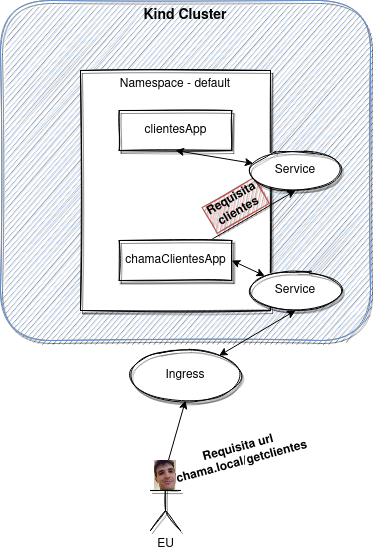
</p>

### Criando o cluster Kind

O comando inicial para criação de um cluster é o seguinte, onde "--name" recebe o nome desejado do cluster, caso esta opção não seja passada, o kind bota o nome que ele quiser. 

```
kind create cluster --name cluster-exemplo
```


Em nosso caso não seguiremos os primeiros passos da documentação, vamos direto a sessão de [ingress](https://kind.sigs.k8s.io/docs/user/ingress/) onde é recomendado a utilização do seguinte arquivo para criação com a função de ingress já habilitada. 

```
kind: Cluster
apiVersion: kind.x-k8s.io/v1alpha4
nodes:
- role: control-plane
  kubeadmConfigPatches:
  - |
    kind: InitConfiguration
    nodeRegistration:
      kubeletExtraArgs:
        node-labels: "ingress-ready=true"
  extraPortMappings:
  - containerPort: 80
    hostPort: 80
    protocol: TCP
  - containerPort: 443
    hostPort: 443
    protocol: TCP
- role: worker
``` 

Então executamos 

```
kind create cluster --config kind-ingress.yml --name kind-clusterzao
```

Desta forma o kind, irá utilizar as configurações do arquivo "kind-ingress.yml" e criar o cluster, que pode ser visto utilizando o comando 

```
kind get clusters
```

<p align="center">
  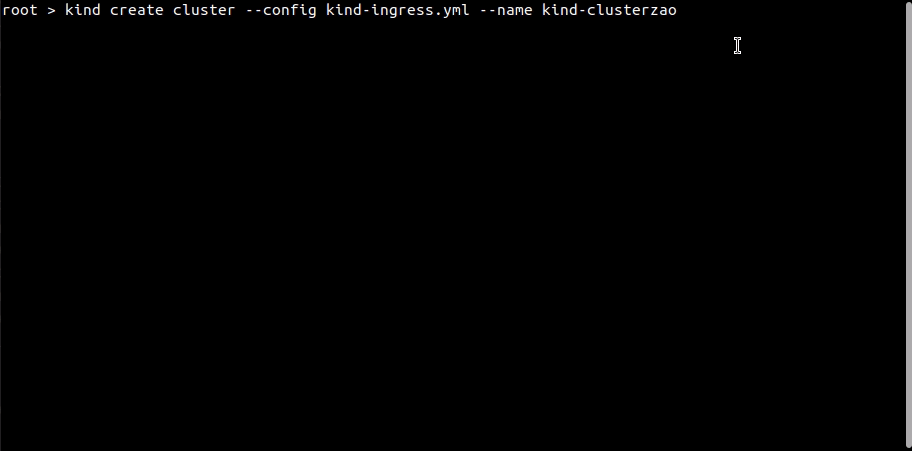
</p>

### Configurando o ingress controller

Seguindo a documentação do kind, vemos na sessão do [ingress nginx](https://kind.sigs.k8s.io/docs/user/ingress/#ingress-nginx), que podemos executar uma chamada já aplicando o ingress-controller, que criará o namespace e demais ferramentas necessárias para o componente ingress ser utilizado posteriormente.

Esta configuração vem do github do kubernetes e é um provider ja conhecido então podemos aplicar tranquilamente.

O comando é o seguinte:

```
kubectl apply -f https://raw.githubusercontent.com/kubernetes/ingress-nginx/main/deploy/static/provider/kind/deploy.yaml
``` 

Em seguida, esperamos o ingress-nginx-controller ficar com o status ready para continuarmos. 

<p align="center">
  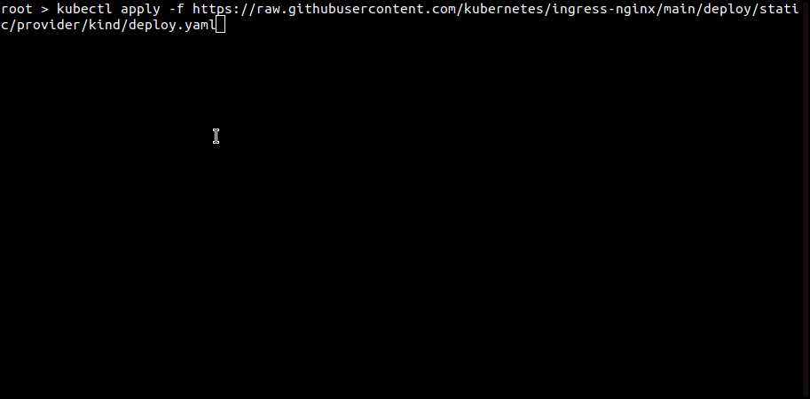
</p>

### Imagens para deployment

Antes de partirmos para a configuração dos arquivos .yml que iremos aplicar no k8s, vamos primeiramente fazer o build das imagens das duas aplicações de exemplo, assim como criar tags para as mesmas.

Acessando o diretório da primeira aplicação o clientesApp, executaremos o seguinte comando: 

```
cd clientesApp
docker build -t clientes:1.0.0 . 
``` 

Em seguida para o chamaClientesApp, o comando identico mudando apenas o nome da imagem: 

```
cd chamaClientesApp
docker build -t chama:1.0.0 . 
```

Desta forma teremos as imagens criadas e podemos ver com o comando: 

```
docker images
```

<p align="center">
  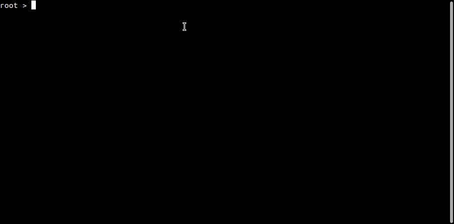
</p>

Com as imagens construidas, podemos então seguir para a criação dos templates de recursos k8s.

### Deployment.yml

Melhor do que eu, a documentação oficial explica muito bem o que é o objeto [deployment](https://kubernetes.io/docs/concepts/workloads/controllers/deployment/) 

Com ela conseguimos criar pods e alterar seu estado, modificando o arquivo de deployment, por exemplo, alterando versão da imagem para rollout e afins. 

Também é possível criar os pods em objetos separados do deployment, como esta sendo feito na [documentação do kind](https://kind.sigs.k8s.io/docs/user/ingress/#ingress-nginx) e também é feito pelo Jeferson no video da Linux Tips.

Os arquivos que iremos aplicar, estão todos no diretório [templates](/templates) e podem ser conferidos por la, aqui e nas proximas sessões usarei apenas alguns de exemplo, para descrever pontos importantes deles.

```
apiVersion: apps/v1
kind: Deployment
metadata:
  name: clientes-deployment
  labels:
    app: clientes
spec:
  replicas: 1
  selector:
    matchLabels:
      app: clientes
  template:
    metadata:
      labels:
        app: clientes
    spec:
      containers:
      - name: clientes
        image: clientes:1.0.0
``` 
- kind - Define o tipo de objeto que será no kubernetes, Deployment, Pod, Service, Ingress, Secret e afins, a documentação oficial descreve bem cada um deles e como cria-los 
- metadata - Definimos o nome e podemos adicionar, por exemplo, labels para nossa aplicação ser localizada por quem faz o match por label
- spec - Esta sessão define quantidade de replicas e demais configurações do container
- replicas - Numero de pod's que serão criados, podemos escalar este numero para quanto desejarmos e quando fizer sentido
- containers - Define o nome do container a ser criado e também qual imagem ele ira utilizar 

### Service.yml

O pod, apesar de receber um IP, eles são objetos que podem viver e morrer muito rapido, desta forma o serviço esta ai, para facilitar nossa vida e permitir apontar para estes pods sem se preocupar com seu endereço IP. 

Minha descrição é meio ruim, então para mais informações e melhor entendimento acesse a [documentação oficial do Service](https://kubernetes.io/docs/concepts/services-networking/service/)

Abaixo vemos como ele é configurado. 

```
kind: Service
apiVersion: v1
metadata:
  name: clientes-service
spec:
  selector:
    app: clientes
  ports:
  - port: 8000
```

- metadata:name: - Define o nome do ojbeto service
- spec:selector: - É aqui é a label definida em deployment é usada, o service da match com base nesta label e sabe quais pods este service corresponde
- ports:-port: - Se observarmos o Dockerfile das aplicações que construimos, eles expoe a aplicação na porta 8000, desta forma, como queremos que o service seja um redirecionador para nossas aplicações, definimos a mesma porta para ele, assim irá conseguir acessar a porta correta que tem conteudo em nossa aplicação

### Ingress.yml

O ingress, o tão importante ingress, que permite nosso acesso de fora do cluster bater em um service dentro do cluster, que por sua vez aponta para um pod, dentro do cluster. 

Como estamos em redes diferentes, o ingress em conjunto ao service permitem o acesso a um pod. Como rodamos localmente, tudo, provavelmente é possível bater no IP do pod e afins, porém o uso do ingress neste contexto também é importante para estudos e entendimento do porque este recurso é utilizado. 

Para maior entendimento, a documentação do kuberentes é otima e pode ser acessa aqui para o [ingress](https://kubernetes.io/docs/concepts/services-networking/ingress/)

```
apiVersion: networking.k8s.io/v1
kind: Ingress
metadata:
  name: clientes-ingress
spec:
  rules:
   - host: "clientes.local"
     http:
      paths:
      - pathType: Prefix
        path: "/"
        backend:
          service:
            name: clientes-service
            port:
              number: 8000
```

- metadata:name: - Define o nome do objeto ingress a ser criado
- host: - Indica qual sera o host que irá representar este ingress, é quem vamos chamar depois quando a aplicação estiver UP
- spec:rules: - Define as regras que o ingress terá, é nesta sessão que definimos alguns tipos de path (pathType) e qual o path nossa aplicação ira responder
- backend:service - É aqui que chamamos o service previamente criado, com o nome identico ao criado, e dizemos em qual porta deste service gostariamos de bater (sim o service pode ter mais de uma porta) 

Observação: Em nosso caso, como estamos rodando localmente para termos a possibilidade de resolver o nome dos hosts, adicionamos, no linux, no arquivo /etc/hosts, os nomes definidos em "hosts" dos arquivos de ingress, exemplo:

<p align="center">
  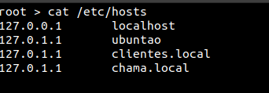
</p>

### Aplicando os templates .yml no k8s

Então, com nosso cluster configurado com um ingress controller, e com nossos templates de deployment, service e ingress criados, vamos aplica-los no nosso cluster kind-clusterzao. 

Iremos utilizar o kubectl com o seguinte sintaxe: 

```
kubectl apply -f ./templates
``` 

E então podemos verificar se tudo foi criado corretamente, executando 

```
kubectl get pods
kubectl get ingress
kubectl get service
``` 

No momento, podemos ver que tivemos um problema com os nosso pods, estão com uma mensagem genérica de "ImagePullBackOff", que indica algum erro ao pegar a imagem. 

<p align="center">
  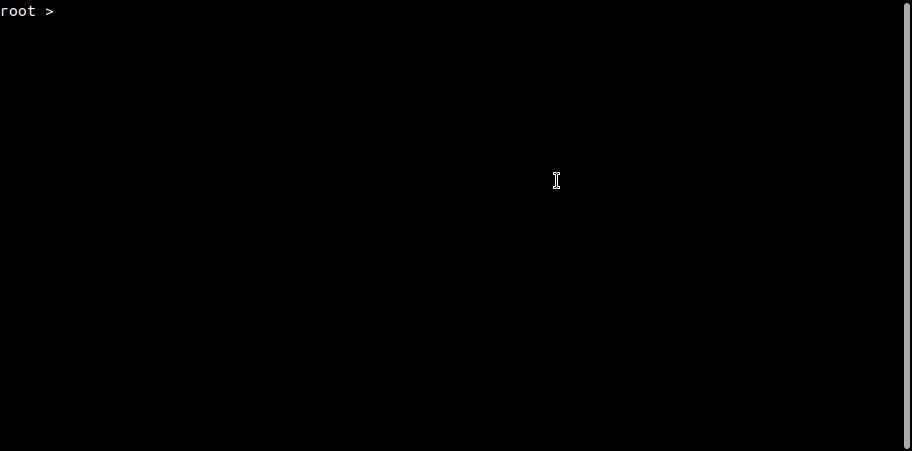
</p>

Podemos então, debugar o pod, utilizando o comando describe, que não só debuga o pod mas como varios outros objetos no k8s, é sempre util para verificarmos se algo esta com erro e se sim descobrir o porque, então vamos lá, vamos verificar o porque o pod esta com este erro, execute: 

```
kubectl describe pod <nome do pod>
```

<p align="center">
  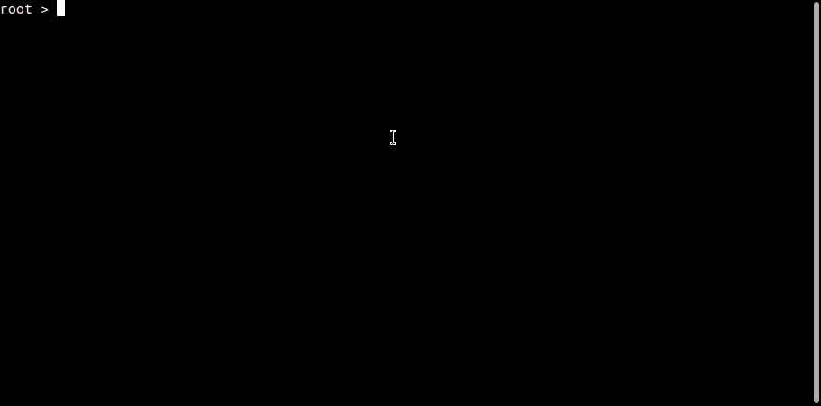
</p>

Agora que utilizamos o describe, e verificamos qual o erro, podemos tomar uma ação, algo ocorre com a nossa imagem local, o k8s não esta conseguindo carrega-la pra o pod. A mensagem é meio genérica e nos da a impressão de ser algo de acesso e afins, porém, depois de muito apanhar e lendo o quick start do kind, vi que existe a sessão de [carregar uma imagem para o cluster](https://kind.sigs.k8s.io/docs/user/quick-start/#loading-an-image-into-your-cluster), e esta parte ainda não fizemos. 

### Carregando uma imagem local para o cluster

O kind, permite a utilização de imagens remota de forma automatica, se você seguir o [tutorial de ingress](https://kind.sigs.k8s.io/docs/user/ingress/) vemos que eles utilizam uma imagem da hashicorp, então não é necessário realizar este carregamento para o cluster, ja que ele vai buscar ela em algum registry. 

No nosso caso, como estamos com a imagem apenas em nossa maquina, necessitamos de executar o seguinte comando para carregar ambas imagens ao cluster. 

```
kind load docker-image chama:1.0.0 clientes:1.0.0 --name kind-clusterzao
``` 

O kind, tem um help um pouco fraco até o momento, e em seu cli alguns erros não são muito explicitos, portanto sempre cuidado na sintaxe, pois muitas vezes é este o problema. Por exemplo o erro abaixo:

<p align="center">
  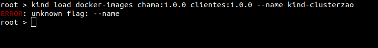
</p>

```
root > kind load docker-images chama:1.0.0 clientes:1.0.0 --name kind-clusterzao
ERROR: unknown flag: --name
```
Este erro, ocorreu porque coloquei o parametro como "docker-images" quando é "docker-image" sem o S, ele erroneamente acusa a flag --name, que esta correta, afinal é obrigatoria nesta opção pois é necessario pasasr o nome do cluster que sera enviada as imagens. 

<p align="center">
  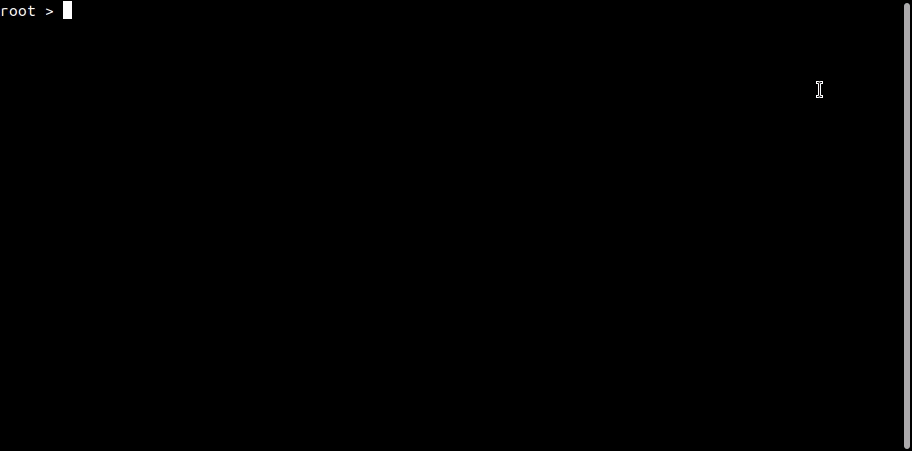
</p>

Após fazer o upload das imagens no cluster, provavelmente vamos conseguir com a aplicação dos tamplates, mas antes de voltar a ele, segue abaixo um artigo que comenta a respeito do uso da tag **latest** nas imagens utilizadas para deployment com kind. 

[Ivan Velichko - KiND - How I Wasted a Day Loading Local Docker Images](https://iximiuz.com/en/posts/kubernetes-kind-load-docker-image/)

Este artigo foi fundamental para eu conseguir fazer o deployment de aplicações com a tag latest, que devem então utilizar em sua descrição o campo imagePullPolicy: Never. 

No artigo esta tudo bem explicado, melhor do que eu poderia fazer neste momento. 

### Voltando a Aplicar os templates .yml no k8s

Após enviarmos as imagens, provavelmente, o pod como é ligeiro espero e maroto, ja vai identificar que esta imagem agora esta disponivel e vai pegar ela corretamente e estará com status UP and RUNNING. Porém podemos também praticar o comando delete, que assim como o apply, faz magicamente o delete de nossos recursos previamente criados. 

```
kubectl delete -f ./templates/
```

<p align="center">
  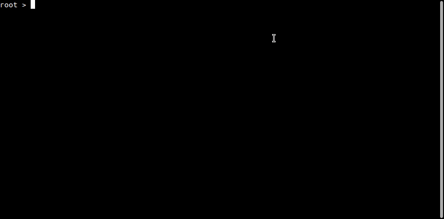
</p>

Em seguida aplicaremos novamente e verificaremos se os recursos foram criados corretamente. 

```
#Aplicando templates
kubectl apply -f ./templates/ 
#Verifica os pods, olhar sempre o status
kubectl get pods
#Verificando se os pods receberam um IP e se estão saudaveis
kubectl describe pods <nome do pod>
#Verificando os logs daquele pod
kubectl logs <nome do pod>
```

<p align="center">
  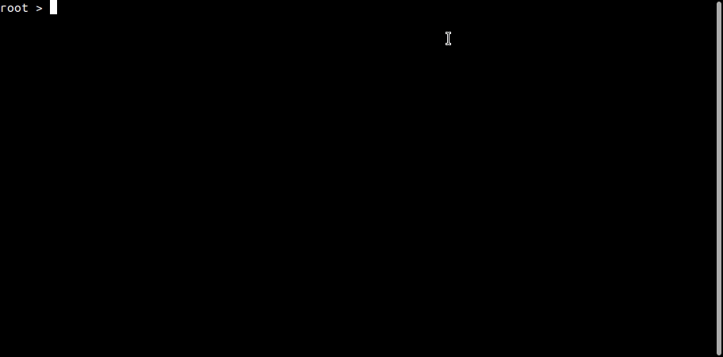
</p>

Desta forma aplicamos nossos templates e vimos que a aplicação esta UP, hora de testar.

### Testando as aplicações

Podemos fazer algumas chamadas para as aplicações usando os hosts criados no /etc/hosts e verificar se o ingress esta funcionando para o redirecionamento. 

A chamada abaixo, deve trazer uma lista simples com alguns clientes do aplicativo com o mesmo nome: 

```
curl http://clientes.local/clientes
```
<p align="center">
  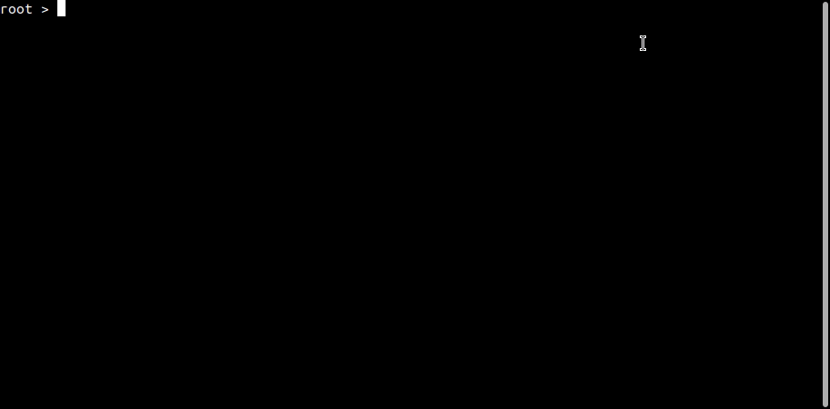
</p>

A chamada abaixo, deve trazer os mesmo clientes, porém veja, que estamos chamado a aplicação **chama**, que tem um service da aplicação **clientes** como variavel de ambiente e faz uma requisição para esta outra aplicação. 

```
curl http://chama.local/getclientes
```

<p align="center">
  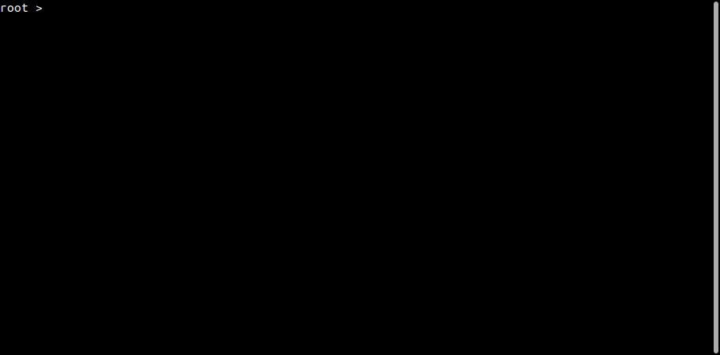
</p>

Vimos então que as aplicações estão UP e funcionais, fazendo chamadas para elas 


### Lens

O Lens é uma otima IDE para K8s, nesta documentação, não entrarei em detalhes, o video da Linux Tips cobre suas funcionalidades de forma excelente, portanto, apenas mostrarei como subir nosso cluster kind-clusterzao no lens. 

Com o lens intalado e aberto, para que ele encontre o nosso cluster kind, temos de ir na opção File>Add Cluster

Temos então de encontrar o kubeconfig criado pelo kind, que geralmente fica em ~/.kube/config. 

De um cat e copie as informações do config na campo do lens e clique em add cluster

<p align="center">
  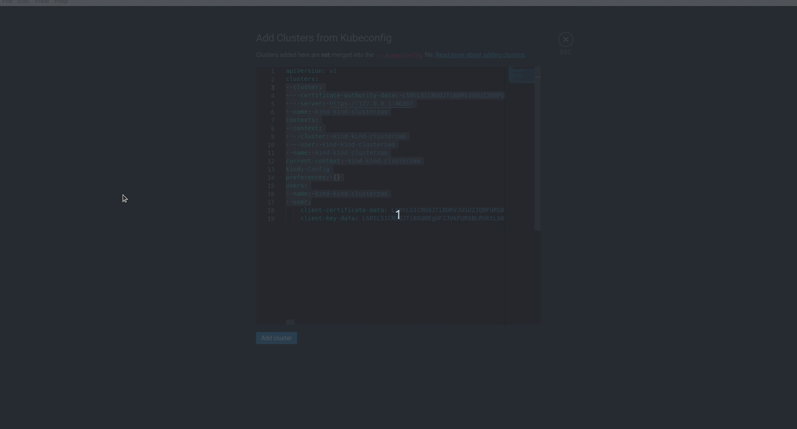
</p>

Desta forma, estará com o cluster configurado e conectado no Lens, e lá pode fazer scale de pods, e obeter diversas informações a respeito do cluster. 

### Conclusão

Subimos um cluster k8s com Kind \o/ !!!! 

O kind abstrai inumeras complexidades na configuração de um cluster k8s e permite realizar testes simples em imagens e afins. Não substitui um cluster completo com suas inumeras funcionalidades e afins.

Em alguns locais até mesmo o ambiente de desenvolvimento deve ter aplicações rodando com alta disponibilidade (o que acho errado, mas é outra discussão), então nestes casos o Kind ou outras ferramentas que "emulam" o k8s localmente ajudam desenvolvedores a testarem suas imagens antes de enviarem para algum outro lugar, porém ja testando em um k8s e não apenas na IDE, o que pode diminuir a incidencia de problemas nos ambientes que vão receber esta aplicação. 

Como dito no inicio, o artigo tem como objetivo documentar o uso do Kind por alguns dias, e pode ter algumas divergencias ou imprecisões técnicas. 

O Claudio do futuro agradece esta documentação, espero que geral curta. 

Podemos para futuro adicionar um prometheus em nosso cluster para monitorar as aplicações, mas só quando der...

Valeu Flw !!! 
