# JMeter rodando no kubernetes

O repositorio referencia para esta publicação, contendo códigos e afins é : https://github.com/Claudio888/kube-jmeter

Trocando uma ideia com meu chapa Vinicius, falando sobre jmeter e ferramentas de teste de carga, lembrei que havia feito para uma empresa uma implementação do jmeter rodando em Openshift, na epoca, precisavamos testar o [Edge MicroGateway do apigee](https://docs.apigee.com/api-platform/microgateway/3.1.x/overview-edge-microgateway), para que as aplicações pudessem se comunicar dentro do cluster e mesmo assim enviar informações para o apigee, sem ter que sair pra internet e voltar, e logo depois o Matheus Fidelis lançou este otimo [artigo](https://fidelissauro.dev/load-testing/) o que me fez querer refazer o projetinho, algo parecido ao menos, pois para a empresa foi criado também uma app em python que enviava uma serie de payloads de tamanho diferentes e especificos para os testes.

Aqui vamos explorar como podemos executar o jmeter, uma famosa ferramenta para testes em software dentro de um cluster k8s (no caso em meu homelab eu uso o KinD). 

Em alguns cenários onde queremos testar uma aplicação com carga, gostariamos de simular as requisições sendo feitas de dentro do cluster, para que um LB, Proxy reverso , api gateway ou afins não interfiram na latencia da resposta e nem acabamos testando as outras ferramentas e não nossa aplicação. Outro cenário valido, é quando temos uma aplicação dentro do cluster que serve apenas internamente.

Por vezes executarmos o teste de nossa maquina local ou uma outra fonte de dentro da mesma rede que não o cluster, o que pode acarretar em variações, mesmo que pequenas, que interfiram no resultado dos testes e não representam a verdade nas informações daquela aplicação.

Portanto um ponto muito importante é saber onde voce quer executar este teste, e qual é a melhor forma de executa-lo. Além de conhecer bem as métricas necessárias para validação da aplicação, entender também o momento do teste, seja no pós deploy de uma pipeline para validar fluxos basicos sem carga excesiva, seja em pipelines exclusivas pra teste de stress, spike e breakout, em ambiente controlado ou não, portanto é muito importante o conhecimento sob a aplicação e requisitos que ela deve atender dentro de um cenário de teste de carga. 

Dito isto, nosso projetinho não inclui todas estas validações ou testes em aplicações reais. Ele tem a intenção de ser um objeto de estudos e de como podemos executar o jmeter desta maneira mais moderna, mesmo ele não sendo nascido nesta era, como outros concorrentes como k6 e afins.

## Objetivos e pré requisitos

Nosso objetivo é ter um teste de carga executado através de uma isntancia de jmeter dentro do cluster, para isto vamos usar como alvo um simples nginx, que no meu cenário em especifico esta deployado no namespace chamado gitlab, e usando o nip.io como auxiliar para criar um ingress legal para localhost, o arquivo base é o [nginx.yaml](nginx.yaml) e pode ser executado como pré requisito (para termos um alvo). 

Através destes teste queremos extrair métricas de execução do jmeter, para isto vamos usar o [jmeter-prometheus-plugin](https://github.com/johrstrom/jmeter-prometheus-plugin) e enviar o resultado para o prometheus, e posteriormente ter um dashboard no grafana. Portanto para ter isto foi necessaria a instalação do [kube-prometheus-stack](https://github.com/prometheus-community/helm-charts/tree/main/charts/kube-prometheus-stack). 

Gostariamos também que nosso teste fosse disparado através de uma pipeline do gitlab, então para este cenário temos também um gitlab instalado dentro do cluster, que ja possui um runner configurado, temos como exemplo esta pagina [Developing for Kubernetes with KinD](https://docs.gitlab.com/charts/development/kind/), o chart utilizado é o [GitLab Chart](https://gitlab.com/gitlab-org/charts/gitlab). 

Além disso, junto a este chart existe o minio, um bucket para salvarmos o resultados dos testes, um arquivo results.jtl e um jmeter.log, que podem ser analisados posteriormente.

Apesar de termos bastante dependencias e configurações adicionais, não se sinta intimidado caso só deseje observar como o jmeter roda, se desejar instale as ferramentas da forma que preferir, ou utilize outras ferramentas para pipeline, caso deseje utilizar, sinta-se livre para modificar e adaptar o projeto, ou usar apenas uma parte.

## Configurações

Como sabemos o k8s é um orquestrador de containers, então devemos criar um Dockerfile do jmeter que seja habilitado a executar a aplicação. O jmeter usa java para execução e portanto definimos um dockerfile desta maneira. 

A imagem é baseada e modifica o projeto https://github.com/justb4/docker-jmeter.

Obs: É plenamente possivel a melhoria na qualidade da imagem do jmeter, sendo criada a partir do apko, por exemplo, podemos fazer estas melhorias posteriormente. 

```
FROM alpine:3.12

ARG JMETER_VERSION="5.6"
ENV JMETER_HOME=/opt/apache-jmeter-${JMETER_VERSION}
ENV JMETER_CUSTOM_PLUGINS_FOLDER=/plugins
ENV	JMETER_BIN=${JMETER_HOME}/bin
ENV	JMETER_DOWNLOAD_URL=https://archive.apache.org/dist/jmeter/binaries/apache-jmeter-${JMETER_VERSION}.tgz

ARG TZ="America/Sao_Paulo"
ENV TZ=${TZ}
RUN    apk update \
	&& apk upgrade \
	&& apk add openssl \
	&& apk add ca-certificates \
	&& update-ca-certificates \
	&& apk add --update openjdk8-jre tzdata curl unzip bash \
	&& apk add --no-cache nss \
	&& rm -rf /var/cache/apk/* \
	&& mkdir -p /tmp/dependencies  \
	&& curl -L --silent ${JMETER_DOWNLOAD_URL} >  /tmp/dependencies/apache-jmeter-${JMETER_VERSION}.tgz  \
	&& mkdir -p /opt  \
	&& tar -xzf /tmp/dependencies/apache-jmeter-${JMETER_VERSION}.tgz -C /opt  \
	&& rm -rf /tmp/dependencies \
	&& echo "prometheus.ip=0.0.0.0" >> /opt/apache-jmeter-5.6/bin/jmeter.properties \
	&& echo "prometheus.delay=120" >> /opt/apache-jmeter-5.6/bin/jmeter.properties 

ENV PATH=$PATH:$JMETER_BIN

COPY entrypoint.sh /
COPY minioupload.sh ${JMETER_HOME}

COPY /plugins/* ${JMETER_HOME}/lib/ext

WORKDIR	${JMETER_HOME}

ENTRYPOINT ["/entrypoint.sh"]
```

Temos como imagem base o alpine, e a instalação de todas dependencias e paths necessarios. O ponto que chama atenção são as configurações especificas do plugin de prometheus. 

As duas linhas abaixo incluem uma configuração especifica para o plugin onde a primeira indica que o exporter vai bindar para 0.0.0.0 e se tornar acessivel, e a segunda aplica um delay para encerramento do streaming de dados via /metrics, neste caso esta 120 segundos ele ira continuar expondo as métricas por este tempo para que o scrape seja completo para todas amostras. 

```
	&& echo "prometheus.ip=0.0.0.0" >> /opt/apache-jmeter-5.6/bin/jmeter.properties \
	&& echo "prometheus.delay=120" >> /opt/apache-jmeter-5.6/bin/jmeter.properties 
```

Apesar de existir uma env criada para custom plugins, foi feita a instalação no caminho tradicional com a linha abaixo, localmente voce também pode instalar neste path. 

```
COPY /plugins/* ${JMETER_HOME}/lib/ext
```

Além de copiar para dentro de si o entrypoint.sh e um minioupload.sh 

Através deste entrypoint é executado o jmeter que se complementa com os parametros passados posteriormente, e também o upload de arquivos para o minio. É possivel alterar o minio para um bucket s3 por exemplo da AWS, ou algum outro local para armazenar os arquivos de resultados, ou caso estes arquivos de resultados não sejam de interesse, podemos remover estar parte.

O minio depende de uma chave e valor, que devem estar configurados com o nome 'minio-secret' no namespace default (onde rodamos os testes). Um bucket com nome jmeter-results também é necessario no minio.

Esta chave e valor podem ser gerados dentro do minio. Em seguida encodados para base 64 e criados no cluster, através do manifesto de exemplo [minioaccess.yaml](minioaccess.yaml)

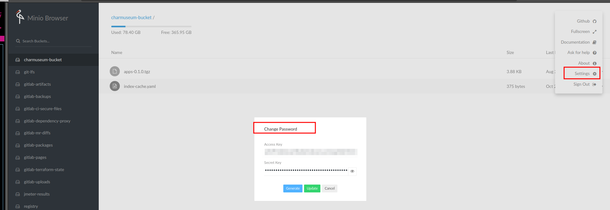


Posteriormente o dockerfile estar correto, buildamos e o enviamos para o registry docker hub, pode ser ecr, ou qualquer outro registry. 

```
docker build -t jmeter:5.6
docker tag <imageid> claudio888/kube-jmeter:5.6
docker push claudio888/kube-jmeter:5.6
```

Pode testar se a imagem esta rodando com o comando abaixo

```
docker run -it jmeter:5.6 --version
```

A resposta provavelmente é esta 

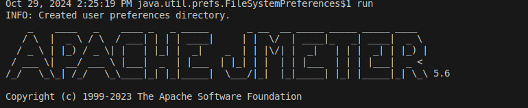

Obs: O comando do minio provavelmente vai ficar rodando, pode cancelar com um ctrl C, este é outro ponto de melhoria, o comando do minio só ser executado caso uma env var especifica seja passada para o job, ou algo que não o torne obrigatorio. 

## Criando manifestos k8s

Após termos a imagem construida e funcional vamos partir para os manifestos k8s que vão permitir sua execução dentro do cluster. 

As configurações se encontram no arquivo [jmeter.yaml](jmeter.yaml) nela temos o seginte. 

### [Job](https://kubernetes.io/docs/concepts/workloads/controllers/job/): 

Responsavel por subir o pod de execução do jmeter, 

Utiliza a imagem que construimos anteriormente e enviamos ao registry

```
...
- image: claudio888/kube-jmeter:5.6
...
```

Possui variaveis de ambiente referenciando o minio para posterior upload. 

Obs: Pode ser melhorado coletando os valores de um secret ou vindo as informações de vault, aws secret manager através de um external secrets operator por exemplo. 

```
...
        env:
        - name: MINIO_ACCESS_KEY
          valueFrom:
            secretKeyRef:
              name: minio-secret
              key: accesskey
        - name: MINIO_SECRET_KEY
          valueFrom:
            secretKeyRef:
              name: minio-secret
              key: secretkey
        - name: MINIO_ADDRESS
          value: "gitlab-minio-svc.gitlab.svc:9000"
...
```

Contem os argumentos para execução do teste e output de results e logs.

```
...
        args: ["-n", "-t", "./jmxfiles/jmxconfig.jmx","-l","results.jtl", "-j", "jmeter.log"]
...        
```

O job lê o arquivo jmx de um configmap previamente criado, do arquivo /jmx-files/<nome do arquivo> 

E este arquivo é montado através de um volume que injeta o seu conteudo dentro do pod(no path jmxfiles)

```
...
        volumeMounts:
          - name: jmxconfig
            mountPath: /opt/apache-jmeter-5.6/jmxfiles
      volumes:
        - name: jmxconfig
          configMap:
            name: jmxconfig
...
```


### Service: 

O serviço que expoe a porta 9270, responsavel por disponibilizar as métricas para scraping pelo prometheus. 

### ServiceMonitor: 

O recurso que expoe para o prometheus qual serviço fazer o scrape dos dados. 

Com o ServiceMonitor o prometheus irá enxergar o pod do jmeter e bater no endereço :9270/metrics e coletar suas métricas expostas. 


## Jmx files

Este arquivo é gerado pelo jmeter, então você pode instalar a ferramenta e criar um teste de seu desejo, e posteriormente salvar o arquivo de extensão .jmx no path jmx-files com um nome desejado. 

No [manual do jmeter](https://jmeter.apache.org/usermanual/get-started.html) existem informações basicas para baixa-lo e executa-lo. 

No nosso exemplo fazemos chamadas simples para o nginx de dentro do cluster, que foi criado e deployado pelo arquivo [nginx.yaml](nginx.yaml). 

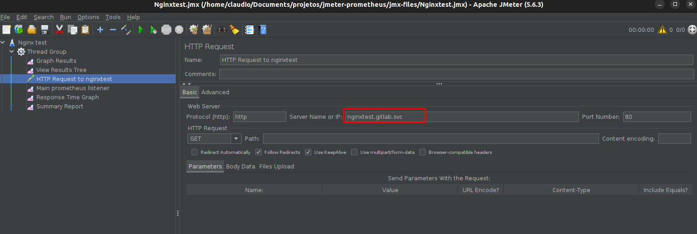

E também configuramos o plugin do jmeter com algumas métricas. 

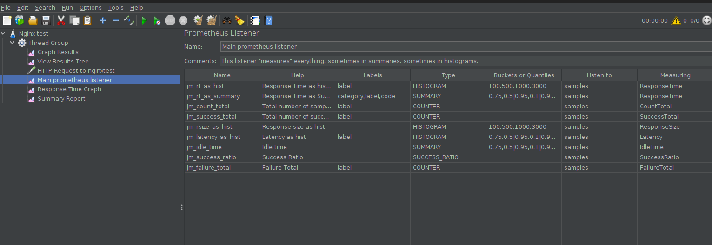

O arquivo jmx é essencial pois ele quem define o que sera feito no teste, sem ele nosso teste não executa. 

## Executando manualmente o job

Com o que temos até o momento é possivel executar manualmente o job dentro do cluster, criando primeiramente o configmap com base em um arquivo e posteriormente chamando o arquivo jmeter.yaml, fazendo o pod ser criado e o teste de carga executado. 

Para criarmos o configmap, me aparentou ser mais facil usar este comando abaixo do que usar o yaml declarativo, por conta do jmx ser extenso. 

Assim ele cria um configmap no namespace default, com o nome jmxconfig e o campo sendo jmxconfig.jmx, seu conteudo então será baseado no arquivo do path jmx-files/<nome do arquivo>

```
kubectl create configmap -n default jmxconfig --from-file=jmxconfig.jmx=jmx-files/Nginxtest.jmx
```
Após criarmos o configmap, voce pode conferir se ele esta OK rodando o comando, o jmxconfig deve estar la. 

```
kubectl get configmaps -n default

# para ver os dados

kubectl describe configmap jmxconfig -n default
```

Em seguida aplique o manifesto do jmeter.yaml, que irá criar o job e afins. 

```
kubectl apply -f jmeter.yaml
```

Bom, provavelmente irá executar o job e seu cluster, podemos debugar observando se o pod foi criado, e quais são seus logs. 

```

kubectl get pods -n default

kubectl logs -n default <nome do pod>  

```

Exemplo de log inicial que o jmeter vai começar a conter. 

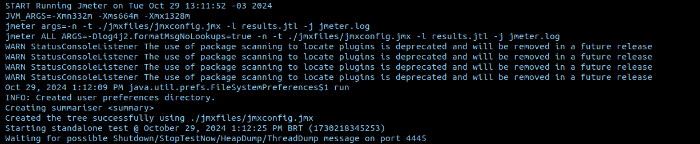

Com isto, em seguida ele irá começar a executar os testes. 

Para conferirmos se as métricas estão sendo expostas, podemos fazer um port forward no pod ou service, e acessar localmente a porta 9270, assim

```
kubectl get svc -n default


kubectl port-forward services/jmeter 9270:9270 

```

E em seguida acessar o endereço localhost:9270/metrics em seu navegador, devemos ter algo neste sentido.


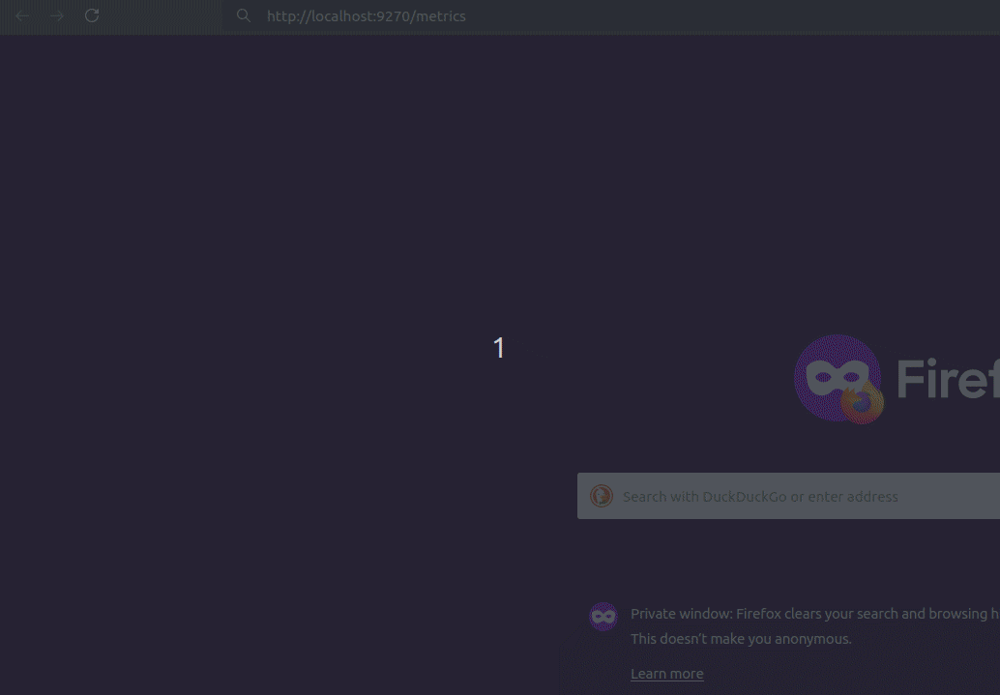


Podemos também conferir no prometheus se as métricas e nosso service monitor foram encontrados e estão corretamente configurados. 

```
kubectl get svc -n monitoring 

kubectl port-forward -n monitoring services/prometheus-k8s 9090:9090
```

Acessando localhost:9090 estamos dentro do prometheus, e podemos ir até status > targets e confirmar se nosso servicemonitor foi adicionado e se esta up. 

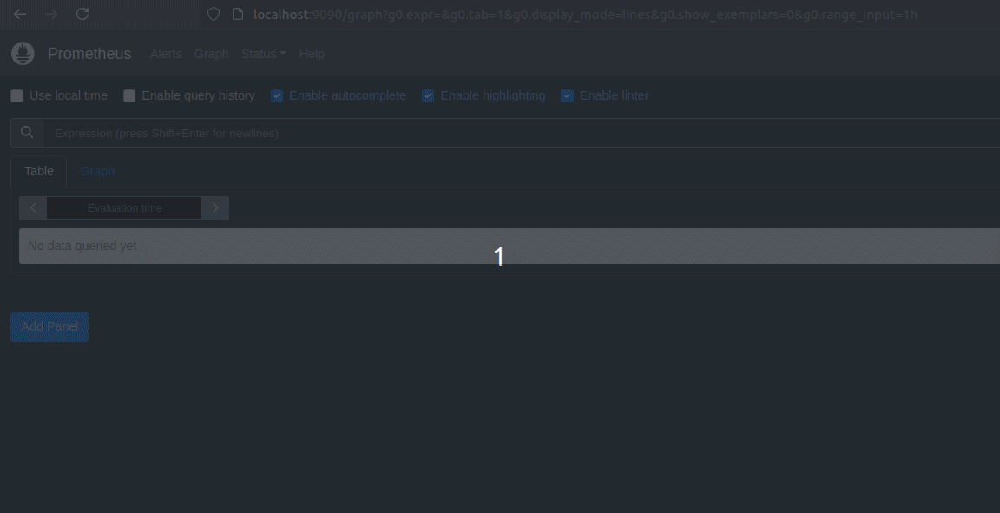

Em seguida podemos procurar por alguma métrica localizada no graph

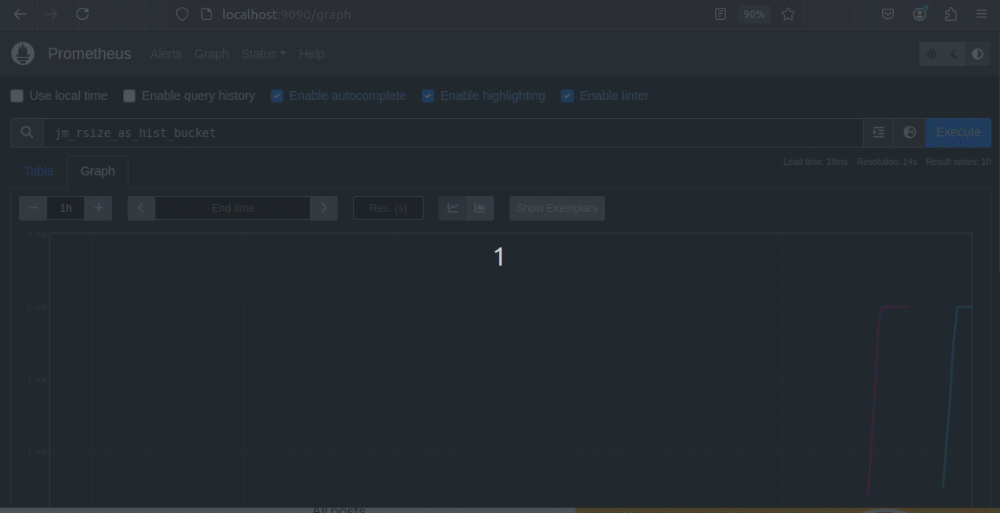


Tendo as métricas no prometheus, podemos agora configurar nosso dashboard no grafana pra visualização. 

Com o kube-prometheus-stack, o grafana ja é instalado, podemos também redirecionar a porta 3000 do grafana para nossa maquina e acessa-lo, usando então o arquivo [dashboard.json](dashbaord.json) e importa-lo para o grafana. 

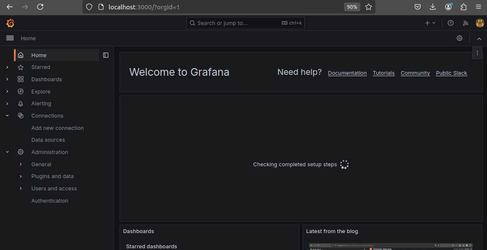


Quando o teste estiver em execução, voce saberá o nome do pod que esta executando, pegue este nome e coloque no filtro de pod no topo do dashboard, assim as métricas serão exibidas com base naquele pod, sendo unico pra cada execução, ficando como o exemplo abaixo.

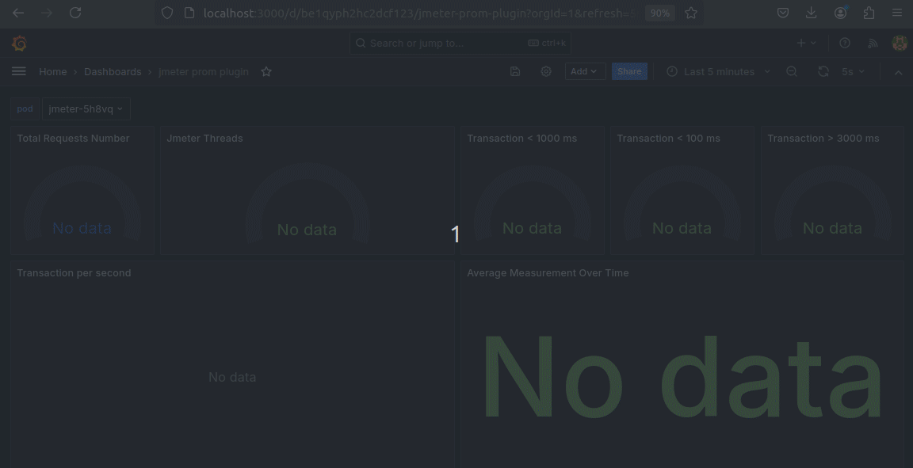


Com o kube-prometheus-stack, temos outros boards que ja são default, como por exemplo o chamado "Kubernetes / Compute Resources / Pod" que contem as métricas computacionais do pod alvo, nele podemos saber o desempenho da aplicação alvo nos testes de performance, o que também é essencial para coleta de métricas e resultados

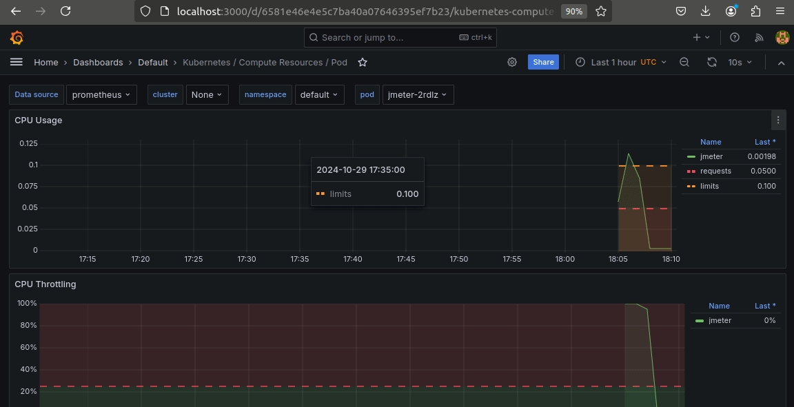

Após a execução, para vermos no minio os relatorios, acessamos o serviço e vamos até o bucket jmeter-results. 

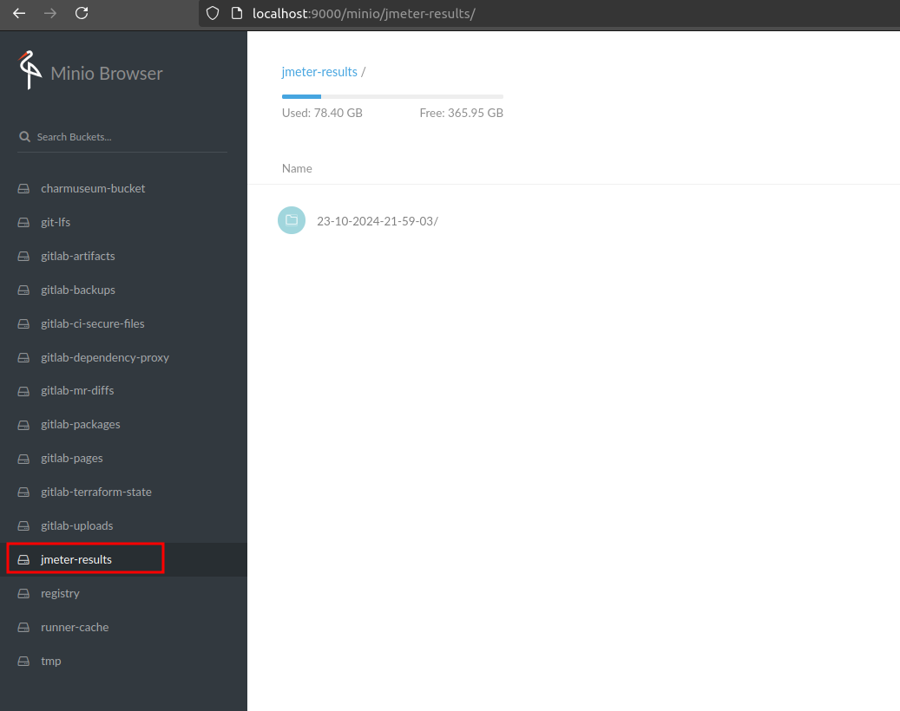


Com esta configuração ja temos a possibilidade de executar testes dentro do cluster, integrando com métricas de prometheus e dashboard do grafana, claro o nivel de depenencias não é baixo e com certeza é mais complexo do que apenas este tutorial, o gitlab, minio, são diversas configurações, porém sinta-se livre para fazer modificações para facilitar isto, ou então usar apenas o dockerfile e os manifestos k8s, removendo o minio e afins se necessario. Vamos ver agora, como fica uma simples pipeline automatizando isto que fizemos. 

## A pipeline

No cenário que tenho no homelab, é um gitlab que ja provisiona um runner dentro do cluster, com service account e afins ja configurados, para possibilidar a execução de comandos k8s deste runner. 

O código presente no arquivo [.gitlab-ci.yml](.gitlab-ci.yml) simplesmente executa de forma sequencial os mesmos comandos que usamos até aqui. 


Ele define um stage e executa com uma imagem base a bitnami/kubectl:latest, que é outro ponto de melhoria, podemos usar uma imagem criada com apko para isto. Será menos espaço ocupado e menos vulnerabildade com certeza. Podemos fazer esta melhoria posteriormente junto ao Dockerfile principal. 

```
stages:
  - executejmeter

executejmeter:
  stage: executejmeter
  image: bitnami/kubectl:latest
```

No script, limpamos o job e o configmap que existirem anteriormente, e rodamos novamente a criação do jmx configmap e em seguida aplicamos o job , service e servicemonitor.

Uma varaivel no momento da execução é necessaria, ela se chama JMXNAME e indica o nome do arquivo jmx que voce deseja que execute, podemos então ter diversos jmx e o usuario apontar qual teste sera executado no momento.

```
...
  script:
    - echo "Limpando ambiente da ultima execução"
    - kubectl get configmap jmxconfig -n default && kubectl delete configmap jmxconfig -n default || echo "ConfigMap não encontrado"
    - kubectl delete job jmeter -n default || echo "Job jmeter não encontrado"
    - echo "Criando jmx especificado $JMXNAME"
    - kubectl create configmap -n default jmxconfig --from-file=jmxconfig.jmx=jmx-files/$JMXNAME
    - kubectl get configmaps -n default
    - echo "Criando e disparando o job do jmeter"
    - kubectl apply -f jmeter.yaml
    - kubectl get jobs -n default
```

Com um job base deste, podemos incrementa-lo posteriormente para rodar junto a uma pipeline de ci/cd completa seja como smoke test após um deployment, ou algum load teste especifico. 

Exemplo da pipeline: 

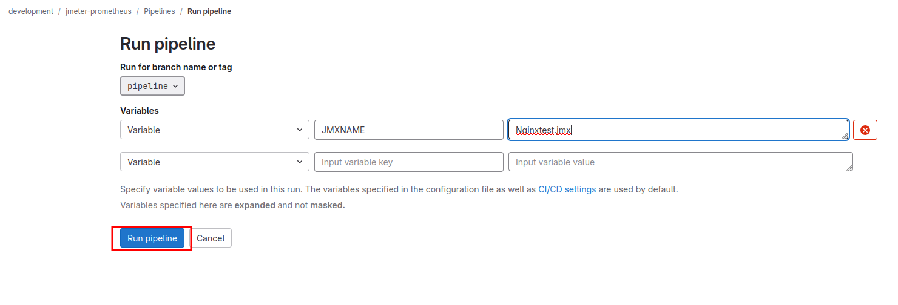

Isto irá disparar o job e toda a cadeia de resultados que vimos anteriormente será preenchido. 

## Conclusão 

Vimos um pequeno projeto para executar o jmeter dentro de um cluster k8s, apontando para uma outra aplicação que também esta dentro do cluster. 

Para isto usamos [Dockerfile](Dockerfile) para construir a imagem do jmeter com prometheus exporter, e posteriormente instalamos ele no cluster usando os manifestos kubernetes presentes em [jmeter.yaml](jmeter.yaml), além de configurarmos o prometheus e o grafana através do [dashboard.json](dashboard.json) para visualização das métricas do teste executado. E por fim automatizamos sua execução através de uma pipeline super simples do gitlab, que executa o job com base no nome de jmx file passado. 

## Dica e proximos passos

Para aprender e entender mais de testes de carga, recomendo este excelente conteudo do Matheus Fidelis [Load Testing](https://fidelissauro.dev/load-testing/), neste artigo é destrinchado todos tipos de testes de carga, como gerar um relatorio, quais as principais questões desta pratica e por fim algumas ferramentas que podemos utilizar para tal.

Podemos continuar esta serie de artigos testando outra ferramenta, o Grafana K6 que deve se integrar melhor e mais facilmente com o grafana e compararmos qual é mais simples e executar e eficiente neste mundo de containers e cloud native. 

## Referencias 

- https://fidelissauro.dev/load-testing/
- https://www.timescale.com/blog/four-types-prometheus-metrics-to-collect/
- https://blog.octoperf.com/jmeter-result-analysis-the-ultimate-guide/#prometheus-listener
- https://jmeter.apache.org/usermanual/get-started.html
- https://github.com/justb4/docker-jmeter
- https://github.com/johrstrom/jmeter-prometheus-plugin
- https://gist.github.com/JustinTimperio/7c7115f87b775618637d67ac911e595f
- https://gist.github.com/PhilipSchmid/1fd2688ace9f51ecaca2788a91fec133
